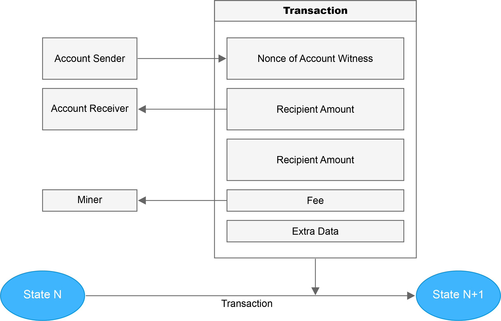

# Transactions

Transactions are proposals to update the ledger and are collected into blocks.

## Transaction data structure
Transaction is created by user and broadcasted into the blockchain network. When the transaction was included in a block and accepted by full nodes, the transactions is confirmed. The data structure of transaction is as below:

```go
type transaction struct {
    AccountNonce uint64 // The nonce value of the account who has launched this transaction 
    Recipient []byte // the counterparty of this transaction which has a length of 22 bytes where the first 2 bytes are used to mark the type of the transaction and the last 20 are the address of the counterparty  
    Amount []byte // transaction amount   
    Fee []byte // the trasaction fee for the miner  
    ExtraData []byte // additional remarks for the transaction, if it is a contract transaction,then it's accompanied by the data of the contract operation  
    Witness []byte // the signature of the originator
}
```

The "AccountNonce" field can avoid a transaction be broadcasted duplicated. And transaction fee would be charged for the usage of computing power and disk space.
     
## Committing transactions

The process of committing a transaction is:

1. User signs off on a transaction from their wallet application to send a certain crypto or token from them to someone else.

2. The transaction is broadcasted by the wallet application. 

3. Some miner packed this transaction and submitted to the verifier group.

4. Verifiers consensus on the block, broadcast the result to the rest of the network. 

5. Full nodes received the verified block from verifiers, update their ledger.

A transaction is a proposal to update the ledger. 

  

The state of ledger can be transfer from one state to another state by processing a transaction.

__State__

State of the ledger is the whole states of all accounts. 

```go
type account struct {
     Nonce uint64 // the total number of transactions originated by this account   
     Balance []byte // the balance of this account address  
     Stake []byte // the amount of the deposit in this account  
     CommitNum uint64 // the total number of messages committed by this account 
     Performance uint64 // the performance as verifier of the account, which is an important factor of the reputation   
     VerifyNum uint64 // the number of blocks that this account should verify in total  
     LastElect uint64 // the height of last elect transaction. The stake cannot be retrieved within 4 periods after the height  
     ContractRoot []byte // the root hash of the contract trie created by this account  
     DataRoot []byte // the root hash of the tree structure of the data generated by the application of the account executed off the chain
}
```

There are two kinds of account:
- Normal account
- Contract account

The fields "Stake", "CommitNumber", "Performance", "VerifyNum" and "LastElect" are used by normal accounts to record their verifier status. 

The fields "ContractRoot" and "DataRoot" are used by contract accounts.

For example, there is a committed transaction that alice transfer 5 coins to Bob, with 0.05 transaction fee. To process this transaction, balance of Alice would minus 5.05,  balance of bob add 5. The rest 0.05 would be distributed to miner and verifiers.

## Transaction validity
Transactions would be validated before add into the blockchain. There are two main rules:

- Transaction is digitally signed by the required parties
- Output state of the transaction is valid

A block is valid when block header is valid, all transactions and verifiers' votes included in the block are valid.