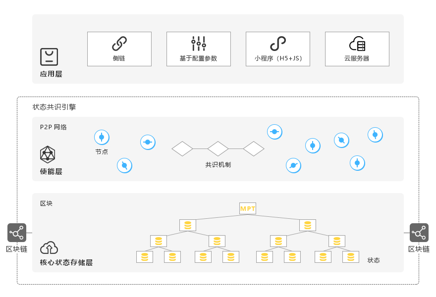

# Smart Contract
## What is a smart contract?
The blockchain concept has been extended over last 9 years, for use not only with crypto currency but other types of records, as well as smart contracts and other decentralized applications. Code is run on the blockchain through the use of smart contracts.

Smart contracts are computer protocols that facilitate, verify, or force the negotiation or performance of contract. Terms of smart contract are recorded in a form of computer code instead of legal language. It can be half-automatically executed by a computer system. In other words, smart contract is computer program that directly controls some digital assets. Smart contracts allows to sign and witness transactions between any two or more parties without the necessity of third party.

## Dipperin smart contract
Dipperin supports smart contract. It follows a structured design philosophy, stripping business logic and state consensus. Is provides a broader and easier-to-use smart contract development support while reducing the load on the main chain.

Dipperin's smart contract architecture consists of the following three layers:  

- __Core state storage layer__: 

    Based on MPT technology, it provides an efficient distributed application state storage, while implementing a chain-limited finite state machine. By applying state constraints on the chain of smart contracts and applying boundary definitions to their contracts, the security and performance energy levels of the application and the underlying blockchain are leapfrogged.

- __Enabling layer__: 

    Consensus communication layer uses P2P communication technology and plugable and replaceable consensus algorithm, and integrates high frequency contract paradigm primitives such as ERC20/ERC721, etc. This layer also provides side chain bidirectional anchoring and cross The basic capabilities of chain communication.

- __Application layer__: 

    change the state of the application through the interface provided by the state consensus engine. The implementation forms include the chain-based high-frequency, paradigm-based dApp based on configuration parameters, and the cloud server interacting with the consensus engine in the wallet sandbox environment. Run the applet (H5+JS), a custom sidechain generated by one-click provided by Dipperin.