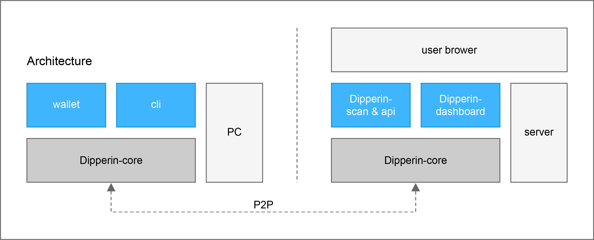

# Architecture Reference

This document describes the architecture design of Dipperin v1.0.0. In the process of implementing Dipperin, some details will be adjusted according to the specific situation and problems.

## Advantages

1. __Random miner and fast confirmation__

    Dipperin retains the randomness of the block produced by the mining mechanism, and the miners with high computational ability will only have a higher probability to produce block, but will not have absolute right to produce block. The block can be accepted by the whole network only after this block verified and signed by the 22 verifiers selected by the whole network.

2. __Fair verifier campaign__

    Unlike most verifier campaign in the market, Dipperin uses a verifiable random algorithm and reputation value election mechanism, which guarantees that there are two factors affecting the results of each round of elections, `rank = w * Random + m * P`, where W and m are the weights of random factors and reputation values.

    [See Yellow Paper for details](./yellowpaper)

3. __Well-designed economic model__ 

    Dipperin has a well-designed economic model to ensure that the rewards for miners and validators are reasonable, and attackers have no inspire to behave malicious. 

4. __Well-designed software architecture__ 

    The architecture of Dipperin-core is well designed to make the program flexible, modular and plugable. Interface is largely used in Dipperin's implementation, to decoupled modules. Design patterns like middleware, decorator are carefully used in the system. 

## System architecture

Dipperin is a decentralized blockchain network. Below is the architecture of Dipperin nodes. The left side of the picture is the architecture of PC user and the right side is the architecture of service provider.



As it shown in the picture, Dipperin-core is the core program, responsible to maintain the ledger and communication with other nodes. To join the Dipperin blockchain network as a full node, user should run a Dipperin-core program. Dipperin-core expose RPC interface to wallets and other applications.

At the PC node, user can call functions of node through wallet and command line tool. At the service provider node, services like blockchain browser can subscribe events, and fetch chain data from Dipperin-core. Provider more functions through web service.

__Dipperin-core__
User run Dipperin-core program to join the Dipperin network. Node programs reach consensus through P2P communication, and the nodes expose RPC functional interfaces to wallets or other applications.

Each node needs to maintain a full-node data locally, which includes block data and link state data. These data are independently maintained by the Dipperin-core node program, and are not affected by external users and programs. Users can only change these data information by sending the correct transaction package to the chain.

Each Dipperin-core node program can be used as a miner or verifier. After the miner node packs the blocks that meet the difficulty requirements, it broadcasts the blocks to the verifier node through P2P communication for verification. The verified blocks are broadcasted to the whole network after the voting consensus is reached through P2P communication between the verifiers.

## Linked Data Structure

We use linked data structures in block and state data.


- Block data:

    Blocks are connected in series by the hash of the former block contained in the latter block. The hash calculation of each block contains information such as transaction and status, so users can not change the data in the block chain at will. Even if they modify the data on their own nodes, they can not pass the consensus check of other nodes.

- State data:

    In Dipperin, state data includes: balance of address, address used to calculate priority parameters, verifier registration list, etc. These data are saved to KV database through Merkle Patricia Tree, and MPT root calculated from them will be put into block header to verify in consensus conditions.

## Transaction

There are different types of transactions in Dipperin. Different transactions are distinguished by counterparty addresses,

Example:

ordinary counterparty address:

```
0x0000 + counterparty's PubKey Hash,
```

registered counterparty address:

```
0x0002 + 00000000000000000000000000000000000000000000000000
```

1. __Normal transaction__

    User make normal transaction to transfer their coins. This kind of transaction only affect accounts' balances.

2. __Verifier register transaction__

    User register as potential verifier by sending verifier register transaction. User specified amount of money will be frozen as a deposit.

3. __Verifier logout transaction__

    If a registered verifier would like to logout, he/she should make a verifier logout transaction. After logout, the user will not be selected as the verifier, but this transaction will not redeem the user's deposit.

4. __Verifier unstake transaction__

    Users can send unstake transaction only after two slots of sending verifier logout transaction to retrieval the deposit. If there is no malpractice evidence transaction towards him/her during this period, which results in the deduction of the user's deposit, the deposit can be successfully redeemed.

5. __Verifier malpractice evidence transaction__

    Once someone discovers that a verifier signs two different block at a same round, he/she can issue a evidence transaction. After the Dipperin cluster confirms the evidence is correct, the verifier deposit is deducted. 

6. __Smart contract transaction__

    User deploy smart contract or call contract functions by sending smart contract transactions.

## Various types of nodes

Dipperin-core is the main program of a node. The communication between nodes is realized through the RPC interface provided by Dipperin-core. Although Dipperin-core provides a way to register third-party services, users can embed their own RPC interface and monitor block events at the code level, we do not recommend such strongly coupled integration.

* __wallet__

    Dipperin-wallet is the minimal Dipperin-decentralized wallet. The wallet will start a Dipperin-core, supports sending transactions, balance queries and other operations through RPC.

* __Dipperincli__

    Dipperincli is the command line tool, can perform all defined operations to the node through RPC interface. It is more powerful than Dipperin-wallet. User can start mining or work as verifier by run commands in Dipperincli.

* __Dipperin__

    There are some clients such as browser plug-ins, which can not synchronize a large amount of data to local. Users can open the RPC interface of a node to the outside and serve browser plug-ins and other applications. User can keep their private keys always stored in client sides, only send signed transactions to the server node when need.

## Future work

We would like to keep our main net simple and secure. The next phase of our plan will focus on complementing several key block chain technologies to the main network:

1. __Virtual machine__

    Under the premise of guaranteeing the efficient operation of the main network, Dipperin introduces the mechanism of virtual machine in the side chain to ensure that it can satisfy the scenarios of unlicensed innovation and secure multi-party computing in the future.

2. __Ultra-light node__

    There are many security risks in the light client implemented by API provided by the central server, such as the central server doing evil, maliciously deceiving the user's private key and so on. Therefore, the implementation of ultra-light node is helpful to solve the situation of these centralized servers doing evil.

3. __Cross-chain transaction__

    At present, whether in public or alliance chains, there will be a scenario of multi-chain communication. Dipperin will also promote optimization in multi-chain communication, cross-chain transaction and so on.