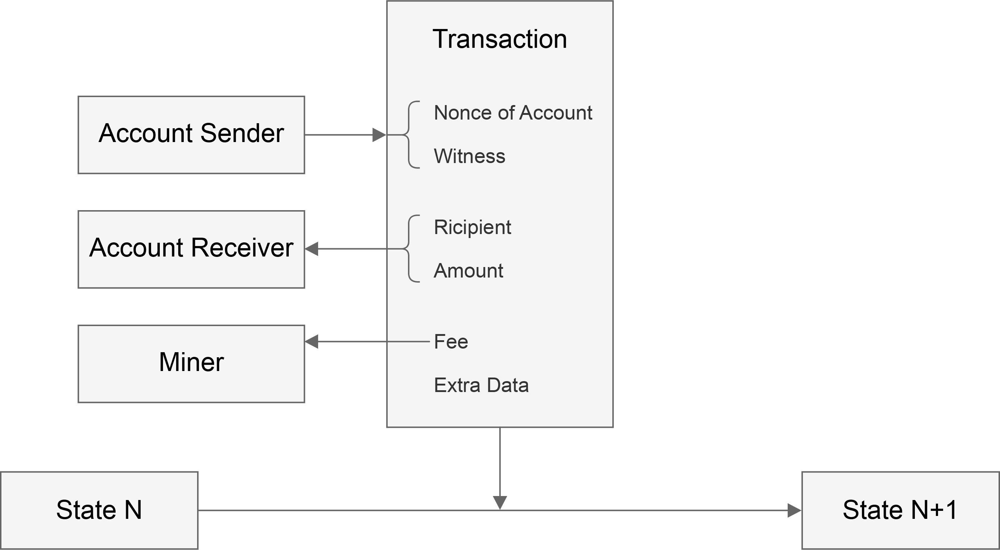
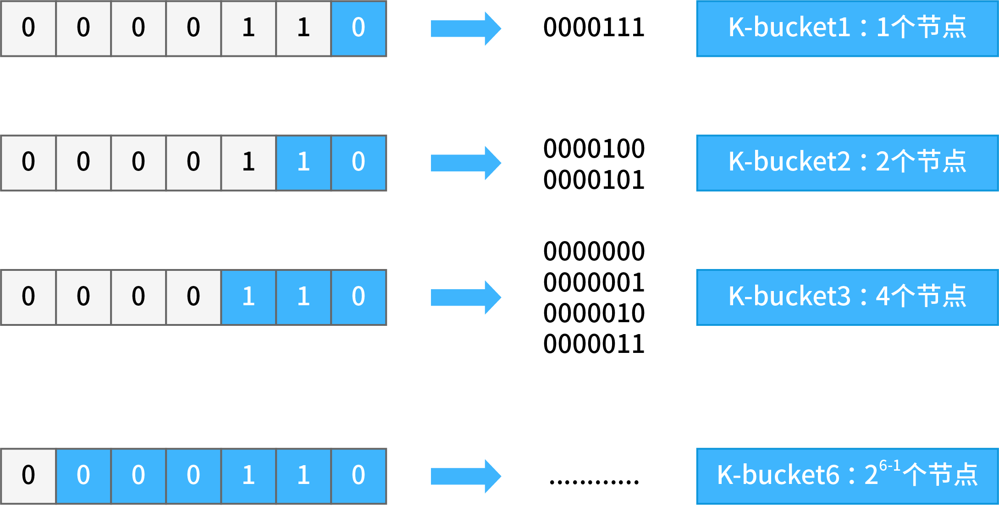
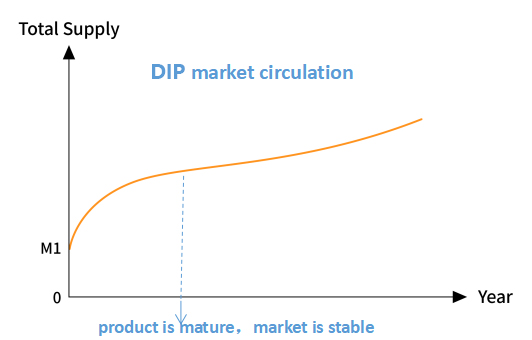
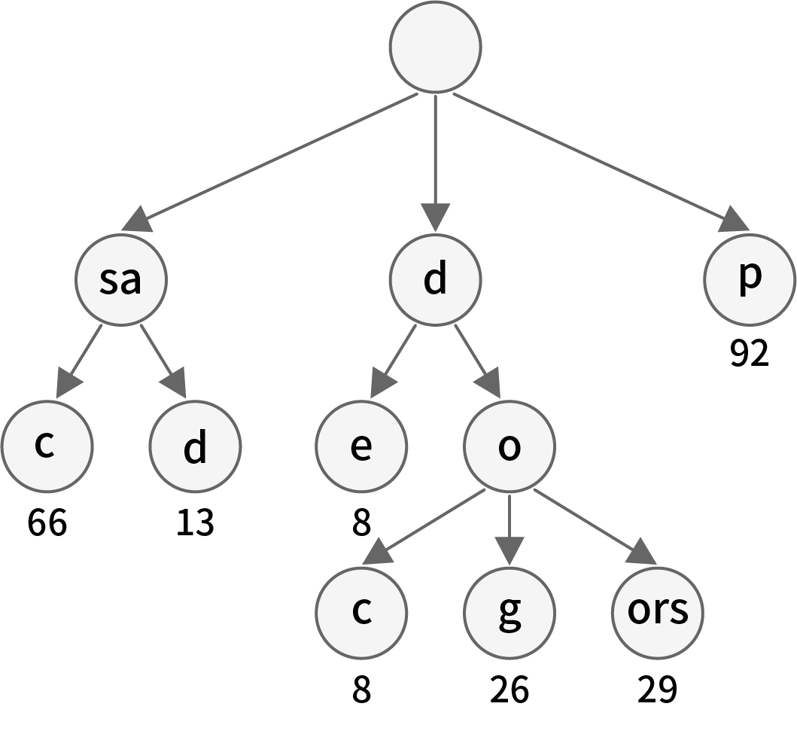

# yellow paper

## Abstract
Dipperin is a public chain positioned for financial applications. At present, the major bottlenecks of mainstream public chain for financial applications are poor performance, insufficient security, lack of privacy protection and difficulty in supervision.  Dipperin applies the following design philosophy: the decentralized level not weaker than Bitcoin, the performance that meet ten million degree DAU, permissionless innovation supported, formalized high frequency applications and the standardization of cross connector and asynchronous trading mechanisms.  Dipperin sets up several kinds of roles, such as ordinary nodes, sharding servers, ordinary miners and verifiers, and applies the DPoW consensus algorithm to set working mechanism for each category based on the reasonable layered architecture. By separating the miners' and the verifiers' work, which is the feature the most interesting, Dipperin retains the level of decentralization, reduces the possibility of fork attacks and simultaneously greatly improve trading TPS. A clear economic reward and punishment mechanism plays an important role in the stable operation of the blockchain while the successful implementation of this mechanism depends on fair election methods.  Dipperin has developed a cryptographic sortition algorithm based on users' reputation, which realizes the decentralized, fair, unpredictable and non-brittle election mechanism, ensuring the fairness and justice of the reward and punishment mechanism in order to maintain the stable operation of the blockchain ecology.

## 1 introduction
From white paper of Bitcoin published by Nakamoto in 2008 to the Bitcoin came out in 2009, and  to the Ethereum shown up in 2014 , more and more distributed applications have sprung up. But all of these distributed systems have serious shortcomings in performance, security, and privacy. The current transaction performance of Bitcoin is about 7TPS, and with the increase of a new block every ten minutes, the storage requires more and more disk space , which has reached about 200G so far.

Upon analysis of the existing popular main public blockchains, it is essential to create a public chain that overrides the shortcomings in performance, security, privacy, efficiency, and decentralization level.  Dipperin is created based on the expectation and is usable in the financial domain. 

Bitcoin uses POW to enable the system to reach a consensus and elect a node that has block-packaging rights at a specific time. However, in addition to the huge problem of scalability in POW, there is another problem that has been criticized, that is, all nodes in the system need to search for suitable random numbers and perform hash calculation without stop. This process requires a lot of power consumption, which causes a huge waste of energy. Futhermore, since the workload is calculated independently among the miners in the POW consensus, the search spaces of the random numbers are overlapped with each other, resulting in inefficiency in the completion of the workload when the difficulty value is fixed. This indirectly leads to system latency and low TPS.  Dipperin has proposed a Deterministic PoW (DPoW) consensus algorithm, which is a miner verifier separation mechanism. Miners use the map-reduce PoW method, and the verifiers confirm the block through the Byzantine Fault Tolerance. Comparing with traditional POW, DPOW increases the TPS greatly by decreasing the difficulty value while retaining the bitcoin decentralization level, therefore reducing energy consumption and improving efficiency.

DPoS is prone to corruption problems, for example EOS representative elections of some important candidates are questioned to bribery. The selection plan of PoW assumes that most of the computing power is loyal, but it seems more reasonable that most of the money is loyal. Algorand uses cryptographic sortition, assuming that most of money is loyal. It selects verifiers randomly, and users with more money are more likely to be selected, which is more reasonable than the first two. However, Algorand's approach may need 4-13 rounds of interaction to reach consensus on a block and the block may be empty, and its throughput is not high enough. Inspired by Algorand, we have proposed a method based on user reputation, using VRF to randomly select verifiers and using PBFT to reach consensus. This approach is really fair for all potential verifiers.

The blockchain is based on the P2P network for data exchange. The P2P mode is different from the traditional client/server mode. Each node can be both a client and a server, so the HTTP protocal is not suitable for communication between nodes.  Dipperin has structured the P2P network and realizes the DHT-based network model and fast routing lookup between points via the Kademlia algorithm. Block synchronization is an important part of communication between nodes.  Dipperin uses reversible Bloom filter technology, so that nodes need only very small network bandwidth, and block synchronization can be realized by just one communication.

So far there are no real public chain with native multi-chain system. The market has some popular cross-chain trading systems, using notary public, two-way anchoring or hash-based locking, while they cannot completely shake off the centralization problem. Based on distributed signature technology,  Dipperin combines zero-knowledge proof and homomorphic encryption technology to achieve a decentralized multi-chain system. As a native multi-chain system,  Dipperin uses a mode of cooperation between the main chain and the side chain. The main chain and the side chain each have their distributed network, miners group, consensus mechanism, and digital assets. They operate in parallel and do not interfere with each other.

For technology details, we will begin with the  Dipperin architecture, and move to P2P networks, block synchronization, mining and verification algorithms, verifier elections, block storage, wallets, and multi-chain systems.

## 2 The Structure of  Dipperin
### 2.1 Block, Transaction and Account State

#### 2.1.1 Block
In Dipperin, the block is composed of the following parts: a set of some related information pieces (named block header), and the transactions, signatures of verifiers and interlink of the super spv.   
```go
type Header struct {
	Version uint64 			// the corresponding version id of the block, use different consensus conditions or different block handling methods for compatibility with subsequent potentiel upgrades
	Number uint64 			// the height of the block
	Seed  []byte 		 	// the seed used for cryptographic sortition
	Proof []byte 			// the VRF proof of the seed
	MinerPubKey []byte 		// miner public key	
	PreHash []byte 			//the hash of the last block 
	Diff uint64 			// difficulty for this block
	TimeStamp []byte  		// timestamp for this block
	CoinBase []byte 		// the address of the miner who mined this block
	Nonce uint64 			// nonce needed to be mined by the miner
	Bloom []byte			// reserved field, used for bloom filter
	TransactionRoot []byte 		// the hash of the transaction trie composed of all transactions in the block
	StateRoot []byte		// MPT trie root for accounts state
	VerificationRoot []byte		// MPT trie root for committed message
	InterlinkRoot []byte 		// MPT trie root for interlink message
	RegisterRoot []byte 		// MPT trie root for register
}
```
In the above four roots, the MPT trie structure corresponding to TransactionRoot, VerificationRoot and InterlinkRoot are stored separately in the block body, and the state MPT trie corresponding to StateRoot is stored in LevelDB. A discussion of the MPT tree will be discussed in detail in the storage section. The corresponding block diagram is as follows:


In this diagram we see that the block header is composed of items listed in the struct above, and the body is composed of items of transactions, of Witnesses and Hashes of interlinks. Of course, there is a huge MPT tree structure which is composed of accounts and this tree is not stored in the blockchain. But its hash root is stored in the block header.

#### 2.1.2 Transaction

```go
type Transaction struct {
	AccountNonce uint64 // The nonce value of the account who has launched this transaction 
	Recipient []byte // the counterparty of this transaction which has a length of 22 bytes where the first 2 bytes are used to mark the type of the transaction and the last 20 are the address of the counterparty  
	Amount []byte // transaction amount   
	Fee []byte // the trasaction fee for the miner  
	ExtraData []byte // additional remarks for the transaction, if it is a contract transaction,then it's accompanied by the data of the contract operation    
	R []byte // the R part of the originator’s signature on the transaction
	S []byte // the S part of the originator's signature on the transaction
	V []byte // the V part of the originator's signature on the transaction
	HashKey []byte // the hashkey of the originator's signature on the transaction
}
```


The transaction structure is as follows：



In this diagram we see that the transaction launches the transition of state. The content in the transaction structure is as explained in the code block where Witness corresponds to R,S,V and HashKey. The address of the sender can be recoverd from the Witness and the nonce of account is also information of the sender.

#### 2.1.3 Account State

```go
type account struct {
	Nonce uint64 // the total number of transactions originated by this account   
	Balance []byte // the balance of this account address  
	Stake []byte // the amount of the deposit in this account  
	CommitNum uint64 // the total number of messages committed by this account 
	Performance uint64 // the performance as verifier of the account, which is an 	important factor of the reputation   
	VerifyNum uint64 // the number of blocks that this account should verify in total  
	LastElect uint64 // the height of last elect transaction. The stake cannot be retrieved within 4 periods after the height  
	ContractRoot []byte // the root hash of the contract trie created by this account  
	DataRoot []byte // the root hash of the tree structure of the data generated by the application of the account executed off the chain      
}
```

### 2.2 Fee Payments
In addition to the cost of the transaction, in order to avoid the abuse of blockchain by individuals,  Dipperin charges the contract data used by the user and the data stored by the custom application, which will be included in the accounts of miners and verifiers.


### 2.3 Transaction Execution

All transactions sent to the  Dipperin network can be packaged by the miners, verified by the verifier, and finally submitted to the chain after verification by consensus conditions. In the process of submitting the transaction to the chain,  Dipperin will perform the operations attached to the transaction and modify the state of the chain. Different operations will be done for different types of transactions by  Dipperin:  

* normal transaction, modify the account balance of the sender and the receiver in the state trie   
* register transaction, modify the balance and the stake of the sender in the state trie   
* cancel transaction, modify the balance and the stake of the sender in the state trie  
* evidence transaction, deduct the deposit from the reported party in the state trie    
* contract transaction, modity the contract data in the state trie   
* storage transaction, modify the storage data in the state trie   

## 3 Consensus Mechanism of Dipperin
In the blockchain system there is no centralized node, which makes the system totally different from traditional centralized server. So in this decentralized environment, how to reach a unified opinion on a problem or proposal requires a consensus mechanism. The core issue for bitcoin or other blockchain systems is how to reach a consensus on a proposal in a decentralized environment.

However, in the blockchain consensus mechanism, there is always an impossible triangular relationship among decentralization, consistency and scalability, namely DCS triangle. That means, at most 2 of these 3 features can be fullfiled for any consensus mechanism in the blockchain system.

In the current blockchain system, the main consensus mechanisms are as follows: POW, POS\DPOS, PBFT, etc., but they all have their own defects. POW pursues a high degree of consistency and decentralisation at the cost of scalability, while POS and DPOS sacrifice decentralization and seek high consistency and scalability. In the blockchain system, if the PBFT consensus algorithm is used alone, then it cannot support the communication between a large number of nodes, but only between a small number of nodes. Furthermore, the shortcomings of these consensus mecanisms also constrain the development of blockchain system. Therefore, all current blockchain systems want to design a consensus mechanism that allows them to find the best balance in the DCS triangle of the blockchain consensus, thereby promoting the development of blockchain technology.

### 3.1 DPOW consensus
In  Dipperin's deterministic proof of work consensus algorithm, nodes are divided into four roles: miners, sharding servers, verifier servers, and common nodes. Each of them assumes different responsibilities in the blockchain system to maintain the stability and security of the system together.

* Ordinary node: It holds the electronic currency circulating in the system and has the right to vote. It has no special responsibility. It can perform ordinary transaction operations and can not vote or be voted in the system. Block data can only be recorded synchronously from the nodes that own packing and accounting rights.

* Sharding Server: It's responsible for packaging transaction table and assign the hash pazzle to the miners

* Miner: It's responsible for resolving the hash puzzle assigned by sharding servers

* Verifier Server: It's mainly responsible for signing the blocks fabricated by miners

#### 3.1.1 MapReduce Mining
The specificity of sharding proof of work lies in that the calculation is accomplished by sharding server and miners togother. The main principle is as follows:

In the pure proof of work mechanism, we find that the miners in the system work seperately. If they execute the proof of work calculations on the same transaction list, then the probability of repeating the work is high, which will result in a longer workload and waste of a lot of power. The process of proof of work using the fragmented POW proposed in this paper is as follows:


1. The sharding server divides the entire search space of proof of work into multiple parts, ensuring that there is no mutual coverage between the divided cells, and assign it to the miner.
2. The miner will calculate the hash value on the assigned search space to seek proof of completion. The miner needs to periodically monitor the message notification of the sharding server during the calculation process in order to respond in time the update of workload search space or reallocation of the task by the sharding server. Once the miner completes the proof of work, the block that meets the conditions is submitted to the sharding server.
3. After receiving the block submitted by the miner, the sharding server submits it to the verification server cluster and waits for the verification.


Here are the pseudo-code for the map-reduce PoW:

```
Precedure map-reduce POW
------------------------------------------------------------------------
 master.start()
 worker.start()
 master.register(worker)　 //notify master about the worker
 master.dispatch(work)    //distribute shards to worker
 notFound = true          //miner starts mining
 while notFound do
 	 worker.change(coinbase) //worker changes coinbase data to make a trial
	 pass = worker.seal()     //worker computes hash and returns true if successful
	 if pass then
		notFound = false
	 end if
 end while
 worker.submit(work)         //worker submits proof of work to master
 pass = master.check(work)  //master verifies validation of proof of work
 if pass then
		master.broadcast(block) //master broadcasts the valid block
 end if 

```

In the above process, the sharding server will listen to the P2P network and package the transaction, but the sharding server will not construct the Merkle tree of the entire transaction. It will only calculate the Merkle path for the coinbase transaction, and the sharding server will send the following data to the miner:

* the hash value of the last block header  
* the difficulty of mining  
* the Merkle Path of the coinbase transaction  
* the transaction-out part of the coinbase transaction  

Apart from the above 4 parts, sharding server will not send miners other information. It waits for the miner to complete the calculation and reply to the message, but it will set a timeout and will not wait indefinitely. Upon expiration, a new fragmentation is reconstructed and assigned to the miners to prevent the system from being blocked because of non completion of the PoW by miners. In addition, when a sharding server completes a PoW proof, the other sharding servers will also package new transactions and reassign tasks to their corresponding miners. The miner performs a hash calculation on the allocated search space after a sharding task is received from the sharding server. First of all, the miner will generate an additional data and splice it into a coinbase transaction with the transaction-out portion of the coinbase transaction sent by the sharding server. This extra data generated by the miner must satisfy a certain format, starting with the miner's ID followed by any additional information. After constructed the coinbase transaction, the miner can use the Merkle path of the coinbase transaction sent by the sharding server to calculate the Merkle root hash value of the transaction list.Then the miner can make the Merkle root hash that meets the specific difficulty value by adjusting the nonce. If the miner can't make the Merkle root hash that meets the specific difficulty value, it can regenerate the extra data and construct a new coinbase transaction. Once a new coinbase transaction is constructed, the entire nonce search space changes, so the miner can perform a workload calculation based on this new search space to obtain a nonce value that satisfies the condition. Since the ID of each miner node is different, the coinbase transactions constructed by each miner are different, so the search space of each miner is also different. Thus, for the same transaction data assigned by the sharding server, the possibility of conflicting proof of work calculations between miners is very low.

Compared with the pure POW consensus mechanism, in the deterministic POW consensus algorithm proposed in this paper, it uses the map-reduce method to distribute the workload to the miners, and avoids the direct repetitive work of the miners. This mechanism has increased the efficiency of the miners' workload and reduced the energy consumption of the traditional POW consensus mechanism. In addition, compared with the treatment of offline mines, the map-reduce mechanism proposed in this paper has a self-determined protocol mechanism.


#### 3.1.2 Byzantine fault tolerance consensus mechanism of verifiers

In the deterministic POW consensus algorithm proposed in this paper, the problem of uncertainty of traditional POW consensus is solved by reasonable introduction of PBFT consensus. In this consensus mechanism, by means of registration, the system selects the verification server, which is responsible for processing the blocks packaged by the miners. This mechanism is characterized by the combination of POW and PBFT. The dedicated miner is responsible for calculating the hash problem and the packaged block performs the PBFT consensus through the verification server, so that the consensus result becomes deterministic. When the miner completes the workload, it submits the block to the verifiers, who will perform a PBFT consensus to select the block so that it be recorded on the chain. The verifier consensus process is as follows:

After the miner finds a candidate block that satisfies the condition with its nonce value, the signed block needs to be sent to the verifier servers. The verifier cluster is generated through the election process and is recorded on the blockchain. When the checker cluster receives the block sent by the miner, it needs to reach a consensus on the legality of the block submitted by the miner. Once the block is verified, it will be recorded on the blockchain, and other nodes in the system can update synchronously the newly recorded block data via the P2P network. The verifier consensus process is completed by PBFT. For the Byzantine problem, the system can only tolerate faulty nodes less than 1/3 of all nodes. Therefore, in the deterministic POW consensus mechanism proposed in this paper, the number of faulty nodes should also be less than 1/3 for the consensus to function correctly.

In the consensus mechanism of the verifiers, some improvements have been made to the original PBFT protocol. The specific consensus is divided into the following steps:

1. There is a master in the verifier group, and the master will present and distribute the blocks received from the miners to other verifiers. This process is called propose  
2. Each of other verifiers executes the verification on the block proposed by master upon reception, and decides whether to vote for the block. If it believes that this block can not be voted, it can vote an empty block called Nil instead. It signs this vote and distribute it to all other verifiers. This process is called prevote.  
3. When the number of votes collected for the proposed block of all the verifiers (including itself) reaches 2/3 of the total number within the predetermined time, then the precommit stage of the block is entered, otherwise it enters the precommit stage of the empty block.  
4. When the number of precommit information collected for the same block reaches 2/3 of all nodes, it enters the commit phase and adds the block to the chain.

It is worth noting that when a node enters the precommit stage of a certain block, it adds a state lock for this block to itself, which means, before the state lock is released, for any subsequent round it can uniquely vote for this locked block and cannot vote on any other blocks. Similarly, when entering the second step above, each node must at first verify whether it has been locked on a different block in which case it can not accept this proposed block but the empty block.

Since there are locking conditions, there are certainly unlocking conditions. Unlock happens in two situations:
* When the locked block reaches the above condition 4 and is added to the blockchain
* When it finds that in the higher round for the same height, there are other nodes locked on other blocks.


Through the above locking and unlocking mechanism, it is possible to prevent lagged synchronization caused by network delay problems for some nodes, and also prevent malicious nodes from manipulating the network so that different honest nodes be locked on different locks, namely deadlock. 

When the number of Byzantine nodes in a checker cluster is less than <code>1/3</code>, the block validity of any miner to the verifier cluster can be correctly verified, and the system can reach a consensus. When the number of Byzantine nodes in the verifier cluster is between <code>1/3</code> and <code>2/3</code>, the verifier cluster cannot reach a consensus on the block sent by the miners. When the Byzantine node in the verifier cluster exceeds <code>2/3</code>, the Byzantine nodes in the cluster can control the consensus result by collusion. Therefore, in the deterministic POW consensus mechanism proposed in this paper, the tolerance of the verifier cluster can only be <code>1/3</code>.

The deterministic POW consensus described above ensures that when a block is validated, it will be irreversible on the chain because the verifiers carry out the block confirmation process and record it to the blockchain through the PBFT consensus, ensuring that there is only one legal block at one time. As for the pure POW consensus mechanism of Bitcoin, there are probably multiple miners who complete the proof of work at the same time, which may lead to fork. In the case that the longest chain cannot be determined, the consensus result is uncertain. Due to the certainty of the consensus mechanism proposed in this paper, the blockchain system adopting this consensus mechanism will not be limited by the speed of block generation. It avoids the fork problem caused by pure POW consensus, and ensures that the system is always a longest chain without fork. By introducing PBFT to reach a consensus on the basis of traditional POW, the scalability of the system is enhanced, so that the consensus of the system is not completely dependent on the computing power competition, and the transaction can be quickly confirmed. Since the consensus between the verifiers is achieved by adopting the PBFT method, high consistency between the verifiers is also ensured.  

In addition, compared with the POS and DPOS consensus mechanisms, in the deterministic POW consensus, each miner and verifier work together to maintain the normal operation of the system. It seperates the rights and uses rewards to combine the nodes. In a blockchain system that uses this consensus, each role can participate in the consensus mechanism, ensuring that the billing rights not be controlled by centralized nodes.  

Since the pure PBFT consensus mechanism is not applicable to the blockchain system with too many nodes, the deterministic POW consensus requires that PBFT be used only between verifiers so that the number of nodes in this consensus break through the limitation in the PBFT consensus mechanism.


### 3.2 Sortition Mechanism Between Verifiers Based on Verifiable Random Function

Of all consensus algorithms, PBFT is particularly characterized by high consistency and efficiency. Nonetheless, at least <code>2/3</code> of all nodes in the system should be honest to ensure the safety and liveness of the system. Therefore, it is essential to select honest nodes as verifiers from so vast candidates.

 Dipperin has applied a cryptographic sortition for verifiers based on VRF(Verifiable Random Function). Every user is assigned a weight according to its reputation in order to resist Sybil attack. This sortition mechanism ensures that only a small percentage of users are selected, and the chance of being selected is propotional to its weight. Futhermore, their identity can be verified by all users. Random results cannot be predicted in advance and cannot be manipulated by any malicious adversory.  Dipperin's sortition mechanism provides objective security, that is, the whole process is objective, and decisions are made entirely through calculations. Human intervention cannot affect this process.

#### 3.2.1 Weighted Users

Reputation is very important in business. Our system quantifies the reputation of users and measures the weight of users by reputation. The verifier is selected by lottery, and the candidate with higher reputation has more chance of being selected. Under hypothesis that <code>2/3</code> of the network's reputation is good, the chain's security can be guaranteed. We believe that reputation-based weights are more fair than weighting method based on computing power or based on stocks.

Reputation : <code>Reputation = F(Stake, Performance ，Nonce)</code>


There are three factors for measuring reputation, stake, performance and nonce.    
The stake deposit determines the cost of cheating and is introduced to defend Sybil attacks. More deposit means more reputation if other conditions are equal.   
Performance represents the user's past working performance as a verifier. More performance means more reputation as well if other conditions are equal. The production of performance depends on use's activity each time as a verifier and the average commit rate.

Nonce is the number of transactions related to this account. Other conditions being equal, higher number of transactions means more reputation. The introduction of the number of transactions is to defend the Sybil attack. For example, the malicious adversory deposits money into multiple new accounts and tries to participate in the election. If this is the case, the account's Nonce will be low and this will have a significant impact on reputation. If Nonce is in a normal range, this factor has little effect.


#### 3.2.2 Cryptographic Sortition

The role of cryptographic sortition is to select candidates as block proposer or verifier whose identity can be verified by all other users. 

The implementation of cryptographic sortition uses VRF: In the VRF algorithm, for a common input, the user can generate a hash value and a proof using its private key SK and a hash function. Other users can use this hash value and the proof, combined with the user's public key PK, to verify whether the hash value is generated by the user for input. In the process, the user's private key is not leaked at all from beginning to end. The user is authenticated in this way, and other users can believe his role as a verifier for a certain period of time. In this way, a set of users can be randomly selected through a common input and their identity can be verified by others. 


```
Procedure Sortition(Stake, Performance，Nonce, Seed)
------------------------------------------------------------------------
reputation = Reputation(Stake, Performance，Nonce)

<hash, proof> = VRF(PrivateKey,Seed)

priority = Priority(hash,reputation)

return (priority, proof)
```

The purpose of our introduction of reputation is to make high-credit users more likely to be selected. But whether a certain user can be selected is not a deterministic event. Therefore, it is necessary to generate a random number seed that can be generally accepted by all nodes in this distributed network. In each round we need a seed that cannot be controlled by any attacker or be predicted in advance. Let us discuss now how this seed is selected.


#### 3.2.3  the production of verifiable random value


**Production of Seed**  </br>
The Seedr of the r round exists in the r-1 block, of which the proposer is selected by the VRF algorithm. <code> Seed<sub>r</sub>, proof := VRF(SK<sub >r-1 proposer</sub> , Seed<sub>r-1</sub>) </code>  
Verifiable random number generation:  
The user takes Seed as input and uses VRF to calculate the random number and Proof.
<code><hash, proof> = VRF(PrivateKey,Seed)</code>  


```
Procedure VRF(sk,input)
------------------------------------------------------------------------
h = hash_to_curve(input)
r =  h^sk
hash = H(r)

k = radom()
pk = g^sk
c = Hash(g,pk,h,g^k,h^k)
s = k - cx mod q   
proof = (r,c,s)

return (hash, proof)
```

Given a user's public key, we are able to deduce whether this pseudo-random hash is generated by the user and this input

```
Precedure VerifiyVRF(input, pk, hash, proof)
------------------------------------------------------------------------
h = hash_to_curve(input)
(r,c,s) = proof
u = (pk)^c * g^s
v = r^c * h^s

if H(g,PK,h,u,v) = c && hash = H(r)
    return ture
else
    return false
```

#### 3.2.4 Priority

Combining the user's reputation R<sub>i</sub> with the above random seed, we can use the following algorithm to generate priority for the user. Based on these verifiable prioritizations, the node is able to recognize if it is a verifier, and other nodes can easily identify whether this node has the right to perform the verification:  
Suppose this seed produces a random number U<sub>i</sub> that is evenly distributed between 0 and 1 for each user.
Then the user's priority  

<code>  Priority=R<sub>i</sub>×U<sub>i</sub>   </code>

### 3.3 How Dipperin Resists Attacks

The consensus mechanism is the soul of the blockchain. The establishment of a reasonable consensus mechanism is the core weapon for the network to resist various internal and external attacks.  Dipperin adopts the DPoW consensus and the VRF-based verifier election mechanism, which is better than the traditional PoW and DPoS consensus algorithm in resisting attacks.

#### 3.3.1 Sybil Attack

The attacker destroys the reputation system of the peer-to-peer network by creating a large number of pseudonym identifiers and uses them to obtain a disproportionate level of control over the peer-to-peer network. For example, the malicious adversory can try controlling the block production process by occupying the verifier seats.  
PoW naturally are resistant to Sybil attacks. In the PBFT verification process of  Dipperin, due to the comprehensive consideration of the deposit, the number of transactions and the performance as verifier into the calculation of the weight, the creation of multiple accounts by candidates will inevitably lead to lower weight of each account, thus reducing the possibility of begin elected.

#### 3.3.2 Bribery Attack

The EOS representative election was questioned by bribery. The  Dipperin verifier election process is transparent. The election result cannot be manipulated by human factor so that there is no person capable of predicting the result, and no miner capable of bribing verifiers to package specific blocks. 

#### 3.3.3 51% Attack

Bitcoin's PoW consensus algorithm cannot resist the 51% attack. By seperating PBFT verification from POW, since each block without the signatures of the verifiers cannot be accepted by nodes, a node or group of nodes who own even 51% computing power cannot restart a new branch in the  Dipperin system.

#### 3.3.4 Seed Dependant Attack

The luck of the  Dipperin verifier candidate is produced by the seed, which is generated by the miners who dig into the last block of each round. It seems that the miner can try to control the seed and thus the value of the luck by iterative calculations.  

While in fact, it is very difficult for miners to do so. Firstly, the miners has no idea in advance whether the blocks they have dug will be taken into the consensus round, and doing so will increase the workload and decrease the possibility of being chosen. Secondly, the sortition of each person is encrypted. Only when the seed is published, each potentiel verifier can check his priority by performing VRF calcultion using seed and ites private key before broadcasting to other nodes for verification. That is to say, even if the miners know their seed in advance, they can only obtain their own priorities without the others', and they have no idea whether they can successfully be elected as a verifier.

## 4. The P2P network transmission of Dipperin

 Dipperin uses DHT(Distributed Hash Table) at P2P network structure, to improve searching effectiveness between nodes and the P2P network capability that defend DOS(Denial of Service) attack. In this case even if a whole batch of nodes in the network were attacked, the availability of the network would not be significantly affected.  Dipperin uses Kademlia algorithm to realize DHT.

### 4.1 The routing lookup of Kademlia

Each Node in Kademlia network will be assigned a unique Node ID. Dipperin adopts the public key generated by a temporary private key of the Node. The distance between nodes can be calculated and measured by the XOR value of the Node ID.

```text
Distance(X, Y) = X.NodeID XOR Y.NodeID
```

Each node produces a list(K-bucket) according to the XOR value of other nodes where K is a system variation, for example 20. Each K-bucket is a list that includes no more than K items, which means one list of all nodes in the network (corresponding to a certain bit, a specific distance from the node) contains at most 20 nodes. As the corresponding bit position becomes lower (the corresponding exclusive or distance is getting shorter and shorter), the number of possible nodes contained by K-bucket decreases rapidly (this is because the closer the exclusive or distance corresponding to K-bucket is, the fewer nodes it has). Therefore, the K-bucket corresponding to lower bit contains obviously nodes of all relevant parts of the network. Since the actual number of nodes in the network is much smaller than the number of possible ID numbers, the K-bucket corresponding to those short distances may have been empty (If the exclusive-or distance is only 1, the maximum number of possible nodes can only be 1. If the node with the exclusive or distance of 1 is not found, the K-bucket that corresponding to the node with the exclusive or distance of 1 is empty). 


Let's take a look at the above simple network who has at present a total of eight nodes each in a small circle (at the bottom of the tree). We consider the node G highlighted in red circle who has three K - bucket, of which the first consists of A, B, C and D (binary representation of 000,001,010 and 011), the second E and F (binary representation of 100 and 101, respectively), the third node H only (binary representation of 111). In the figure, all three K-buckets are represented by gray circles. If the size (that is, the value of K) of the K-bucket is 2, then the first K-bucket can only contain 2 of the 4 nodes. As is known to all, nodes that have been connected online for a long time are more likely to remain online in the future. Based on the law of static statistical distribution, Kademlia prefers to store those nodes into K-bucket, which increases the number of effective nodes at a certain time in the future and provides a more stable network. When a K-bucket is full and a new node corresponding to the bucket is found, the earliest visited node in the K-bucket should be checked and if the node is still alive, the new node should be placed to the list of affiliate (as an alternative cache). The alternative cache is used only when the node stops responding. In other words, newly discovered nodes are used only when the old ones disappear.

Stratification by XOR distance can be generally understood as stratification by bit number. Imagine the following scenario: on the basis of 0000110 nodes, all the digits ahead are the same as the ID of one node and only the last one digit is different. This kind of node has only one - 0000111, whose XOR value with the basic node is 0000001, which means the distance is 1; For 0000110, such nodes are grouped as "K-bucket 1". Consider another scenario: all previous digits of one node ID are the same, and are different only from the last second digit. This kind of node only has two: 0000101, 0000100, whose XOR value with basic node are 0000011 and 0000010, and so the distance range are 3 and 2; For 0000110, such nodes are grouped as "K-bucket 2"



When a node has K-bucket, it will look for other nodes. Suppose node A(node_id:00000110) wants to find node H
(node_id:00010000), A need to calculate the distance between H and itself at first;

```text
Distance(A, H) = A.NodeID XOR H.NodeID = 00000110 XOR 00010000

Distance(A, H) = 00010110
```

The XOR distance of node A with node H is 00010110, so the distance range is [2<sup>4</sup>, 2<sup>5</sup>), so node H may be in the K-bucket 5 (in other words, the Node ID of node A and H differs from the 5th bit, so node H may be in K-bucket 5). Then node A needs to check whether node H lies in its K-bucket 5 ;

> If so, search the node H directly;

> If not, select arbitrarily a node B in K-bucket 5 (for any node B, its fifth digit of Node ID must be the same as Z, which means the distance with node Z will be less than 2<sup>4</sup>, almost half the distance between A and Z), and request node B to search node Z in its own K-bucket by the same method.

>>	If B knows node Z, it tells the IP Address of node Z to node A;

>>	If node B doesn't know node Z, node B can find node C closer to node Z in his own K - bucket by the same method (the distance between Z and C is less than 2<sup>3</sup>), and recommend node C to A; node A requests node C to perform the next search. 


Kademlia's query mechanism is a bit like arbitrarily folding a piece of paper to shrink the search range, ensuring that for any n nodes, only log<sub>2</sub>n times' query are needed to find the contact information of the target node (that is, for any network with [2<sup>n−1</sup> , 2<sup>n</sup> ) nodes, at most n steps of search are needed to find the target node).


### 4.2 The concrete realization of P2P network

Before the chain release,  Dipperin deploys some start nodes (BootNode), hard-coded in the program. In this way, when these nodes are started for the first time, they will connect automatically the bootnodes, exchange the K-bucket between the nodes, and obtain more nodes ID to make connections, thus joining the entire Dipperin network. 


The first time the node starts to read the bootnode information, it updates the local K-bucket with the local node ID as the target, and then updates the node every interval. The process of refreshing the K-bucket is as follows:

1. Randomly generate the target node ID and mark it as TargetId. Record the number of discovery times and refresh the time from 1.  
2. Locate the 16 nodes closest to the target node in the K-bucket of the current node  
3. Send the findnode command to each of the nodes obtained in step 2, and receive the adjacent nodes returned by each node  
4. Ping-pong test on each node returned by step 3 and update to local K-bucket  
5. The above discovery processes are all based on UDP. The p2p network will randomly select the unconnected nodes in K-bucket for TCP connection at regular intervals and execute the communication in the connected TCP channels (the TCP connection coroutine will do the heartbeat to maintain this connection by itself).


### 4.3 Invertible Bloomfilter Lookup Table

In blockchain network, nodes need to execute the block synchronization with other nodes through P2P network transmission, that is, to find out transactions existing in others but not in their own nodes and add these transactions to their own blocks. We assume that most transactions in the trading pool between the nodes should be the same. The most traditional method is that node A sends the excavated block to B directly. The bandwith requirement would be the size of one block. Since most transactions in the trading pool are the same, this approach takes up a large amount of network bandwidth and appears to be extremely inefficient. Therefore, we use a method called Invertible Bloomfilter Lookup Table (hereinafter referred to as IBLT) to achieve block synchronization. IBLT is a method based on the evolution of bloomfilter. It is an improved scheme from the disadvantage of bloomfilter that requires two communications to complete block synchronization. Refer to Appendix A for details on bloom filters.

4.3.1 Principle of IBLT

IBLT is used to restore the values of key-value pairs. It follows the prototype of bloomfilter, including k hash functions and a set of storage units, called bucket here. Instead of being 1 bit in size, a bucket can contain larger elements. The struct of a bucket is as follows:

```go
type Bucket struct {
	count    // a counting item to record the number of operation
	keySum   // the sum of all keys mapped to the current bucket.
	valueSum  // the sum of all values mapped to the current bucket
	keyhashSum  // the sum of the Hash values that are mapped to all keys in the current bucket using a particular Hash function. The usage of this field will be discussed later when we judge whether a bucket is a pure bucket.
}
```

The usage of <code>count</code> is similar to that of the Bloomfilter, except that whenever there is a hash operation mapped on the current bucket, the value of count is incremented by 1. Therefore, the value of count will be the number of hash mappings, and the value range is any integer greater than or equal to 0, not just <code>{0,1}</code>.

We allow new elements to be added to the IBLT constantly (that is, the values of the above four fields are updated into the corresponding <code>k</code> buckets through <code>k</code> Hash functions), and only added elements are allowed to be taken out of the IBLT (unadded elements cannot be subtracted). If we want to restore all of the key-value pairs from the invertible bloomfilter above, we need to find the buckets where <code>count=1</code>, because only the key-value of one element is stored in these buckets. After restoring the element, we can update it by subtracting the key and value of the element from the keySum and valueSum in the other buckets to which the k hashes are mapped, and the count values in these buckets are also subtract by 1. After such transformation, we can continue to look for the bucket with count value of 1 and peel off the key and value values of the element until <code>count=0</code> or count value is at least 2 in all buckets.  

If there are no buckets with count 1 but still buckets with count value at least 2, then the algorithm fails. However, this rarely happens when we choose the memory size and <code>k</code> value size reasonably.   

Through mathematical derivation and prove, we find that when the KV pair inserted is less than a certain value, IBLT has a very high probability to recover successfully. However, when the KV pairs inserted are slightly more than this threshold, the probability of IBLT's successful recovery decreases rapidly. This threshold is related to the number of bucket in IBLT. It can be deduced that at <code>K=4</code>, the effect of IBLT is the best, in which case inserting <code>M</code> KV pairs means the number of buckets greater than <code>1.3M</code>, so  

<code>N>= 1.3*M, K = 4</code> 
 

So we found that this algorithm is not meaningful for restoring the elements of an entire set. It only makes sense to find the difference of two sets (that is, the elements that another set does not have). Especially when the set itself is large, and each has only a few elements to be synchronized.
 
  
Since our purpose is to let the nodes find the transactions they don't own but other nodes have, that is to find the difference set with other nodes, without having to restore all the elements through this IBLT. So what we're more concerned about are

* How to accurately restore the filters after subtracting two IBLT.   
* How to choose the size of this filter.   


**Subtraction of IBLT**

To solve these two problems, we introduce subtraction between filters. This subtraction allows to subtract elements from IBLT that are not added to the IBLT. Upon reception of IBLT sent by other nodes, each node can substract it by the IBLT of its own to peel the element one by one fom the bucket that start from <code>count=1</code>.
 


 
But we find that after making the difference between two IBLTs, it might not be feasible to strip the element from a bucket with count value of 1. Because if A bucket does the calculation of A plus B minus C, count is still going to be 1, but its key is going to be <code>key(A)+key(B)-key(C)</code> who is not the key of a single element. So the question is how do we tell if this value is the key of a single element? In this case, the fourth element in the bucket we mentioned earlier, <code>keyHashSum</code>, comes in handy.  
 

 
Buckets with <code>count=1</code> and can be stripped off the key value of a single element (that is, keySum is the key value of a single element) are called pure buckets. We use keyHashSum to help figure out whether a bucket is pure.  
 

 
KeyHashSum is the sum of all hash values mapped to the key of the bucket. Note H the hash function we choose. We know that for hash operation, <code>H(A)+H(B)=H(A+B)</code> does not exist, so when the count=1, the key value in the bucket might be in these two situations below:

* KeySum is the key value of some element x. In this case, <code>keyHashSum=H(keySum)</code>. This equation can be verified immediately and inform us that the key is the key value of a single element and the bucket is a pure bucket.

* KeySum is actually the result of the sum of two key values <code>(x,y)</code> minus another element <code>(z)</code> 's key values. In this case <code>KeyHashSum = H(x)+H(y)-H(z)</code>, which is not the same as <code>H(keySum)=H(x+y-z)</code>. So we know that this bucket is not a pure bucket.

 

 
By starting from the pure bucket, we can peel off the transactions one by one, that is, we can restore the transactions not already owned and realise the synchronization.
 

**The summary of IBLT**

 
The cleverness of this approach is that we use a data structure in constant space where the growth of the data structure is linear when the element inserted is less than a threshold.But beyond this threshold, the size of the data structure does not increase, but only related to our parameter setting. We use about 1.3 times the space of the differential elements to eliminate a large number of common element transmissions. From our P2P network hypothesis, we know that most nodes have a large number of similar elements. When a node synchronizes, it wastes network bandwidth if it transfers a large number of these common elements.Therefore, we can find that the efficiency of this data structure is better when the number of common elements is larger.
 

 

#### 4.3.2 Estimator

 
In the implementation process of IBLT algorithm, it is very important to estimate the size of this difference set. If the estimated size of the difference set is too large, then the purpose of saving space and improving transmission efficiency cannot be achieved; if the estimated size is too small, the IBLT may not be resolved.
 

 
In the real scenario, we have no information about the similarity between the two sets. If we fix the parameters of IBLT, then when the difference between the two sets is greater than the tolerance range of IBLT, the receiver cannot successfully solve the compressed data by subtraction between the two sets of IBLT. But if we are able to estimate difference size between two sets in advance, the size of IBLT can be adjusted in real-time according to the size of the differences, in which case successful solution is guaranteed when the collection difference is too large, while if the difference is too small, a smaller IBLT is used to reduce the amount of data that needs to be transferred for synchronization.
 

 
Let's first introduce two methods based on sampling estimation respectively, MinHash and Strata. MinHash works when there is a large difference between the two sets, and Strata works when the difference is small. We finally use the hybride method of the two to estimate the size.
 

 

**MinHash**   
MinHash is an estimation method based on random sampling. Random sampling statistics are very common on daily. Imagine we need to count the incidence of a genetic disease in a group of people, say, 1 million. We then have to pick uniformly at random 1,000 samples out of the group, and if 100 out of this 1,000 people are sick, then we can conclude with a lot of confidence that the incidence is 10 percent, and that 100,000 out of a million people are sick.
 

 
In order to ensure the accuracy of random sampling, the sampling execution process needs to meet certain preconditions:

1. Uniform and random extraction is required during extraction. For example, if we choose to carry out sampling in the department of genetic disease treatment, the prevalence rate estimated by sampling will greatly exceed the general population, leading to incorrect conclusions.  
2. Reasonable selection of sample size. If the incidence of this genetic disease is very low, say 100 out of one million, then there's a high probability that we won't be able to get one sample from 1,000 people. That leads to conclude that the prevalence is zero.

 

 
MinHash first hashes all the elements in the set, and then selects the N elements with smallest hash values. As a good hash function is uniform enough, this process guarantees that our sampling is random and uniform. Compare the <code>N</code> hashes we extracted from one set with the <code>N</code> hashes that we extracted from another set, and if there are <code>M</code> common hashes between these 2 selections, then we estimate that the similarity between the two sets is <code>M/N</code>. This is the most basic and simplest idea. Obviously we find that this is affected by the second requirement of random sampling. That is, if our parameter chosen is not good, for example in the <code>N</code> selected elements the common elements are very few, then our estimation error will be very large.
 
To address this issue, we have a simple idea, which is to do multiple different samplings before calculating the average over the estimates of these samples. We pick <code>K</code> hash functions，and choose <code>N</code> elements with smallest hash values for each of these hash functions to compare with the smallest hash in another set. Assume there are <code>M</code> common hash values, then for each hash function the similarity is 

<code>S<sub>i</sub>=M<sub>i</sub>/N</code>, <code>i=1, 2..., K</code>   

We can average the K outcomes to get the estimation of <code>S</code>


We find from this formula that this process is essentially equivalent to selecting the <code>KN</code> hashed elements and then finding the same number in the <code>KN</code> elements. The difference is that the strategy of taking <code>K</code> times <code>N</code> is allowed to have repeated selections compared to directly selecting <code>KN</code> elements with the smallest hash, and the <code>K</code> experiment should ideally be independent and random. The range of the similarity <code>S</code> is between 0 and 1, where 0 means that the set does not have any coincident parts while 1 means that the sets are identical.
 
 
After obtaining the value of <code>S</code>, the similarity is then  
 

<code>D = (1-S)/(1+S)*L</code>


Where <code>L=L<sub>1</sub>+L<sub>2</sub></code> is the sum of the size of two sets  

This formula is indeed quite obvious. <code>L<sub>1</sub>+L<sub>2</sub></code> includes the part of <code>S</code>, and <code>1+S</code> id used as the denominator to standardize the number. By multiplying it with <code>1-S</code>, the difference of the set is obtained.  
 

 


 

 

**Strata**  
The Strata(layer method) first layered the elements in the set, and which layer the element is assigned to is determined by its hash. The way to do that is to observe the number of zeros lie on the left side of the binary hash. Because of the randomness of the hash function, there is no difference if we count the number of zeros on the left side or the number of zeros on the right side. Here we choose the number of zeros on the left side to decide the level of each element. If the binary of an element's hash value is not 0 at the beginning of the left side, which means the binary value starts with 1, then we put it on the lowest layer (the 0th). If there is only one 0 from the left side, we then put it on the second lower level (level 1), and so on. If the number of zeros on the left of the binary value exceeds our number of levels, we then put it on the highest level.  
 

 
It's not hard to see that if we're using a good hash function, then ideally we should be able to get approximately one half of total elements of the set on layer 0 and a quarter of the elements on layer 1; By analogy, we should be able to get on the <code>i<sup>th</sup></code> layer <code>1/2<sup>i</sup> </code> elements, that is, the distribution of the number of elements is a geometric sequence distribution with <code>1/2</code> as the proportion parameter.
 

 
Each layer of the hierarchical approach consists of an IBLT, which is fixed in length and relatively small, with a typical value of 80. when constructing, each element of the set is inserted into the corresponding layer.  Then at the time of estimation, the IBLT of the two corresponding layers is subtracted from the highest level for getting resolved until the solution is not solved or all of them can be successfully solved.
 

 
Obviously, if we can solve all of them, then the sum of the number of data on each layer would be the difference between the two sets, and the difference would be accurate. While if we see that IBLT starts to fail at some level, then we can stop there, because it's bound to fail when we continue. Then we use the sum number of the elements that solved from all high levels and multiplied by 2<sup>{I+1}</sup>, <code>i</code> is the height of the layer at this time, namely:
 

<code>D<sub>{estimated}</sub> = count * 2<sup>{I+1}</sup> </code>
 
It's not hard to see, as the number of elements is evenly distributed, the sum of geometric series with <code>1/2</code> as the proportion has this following rule:
 

<code>S<sub>i</sub> = S<sub>i+1</sub> + S<sub>i+2</sub>+ ......    </code>


Namely, <code>1/2=1/4+1/8+......</code>, and <code>1/4=1/8+1/16+......</code>.  
 

 
Take <code>1/4</code> as an example, our <code>count</code> includes everything from <code>1/8+1/16+...</code> We can get a good estimate by multiplying it with a <code>4</code>.
 

 
The disadvantages of the layered approach are also very obvious. If the two sets of elements are quite different, then the top layer of strata would be full of elements. When all the layers are piled up, the solution would fail from the beginning, and our estimation becomes impossible. And when we fail in comparing the high level, our count is small, which means the multiplied coefficient <code>2<sup>(i+1)</sup></code> is larger. In this case the influence of a tiny change of <code>count</code> is so big that the error of our estimation will be very large. The error of the Strata method is very large when the difference is large, which is also a conclusion given by the author in the original paper.
 

**Hybrid**  

 
MinHash doesn't work when the difference is small, while strata can detect the difference without error in this case. MinHash can guarantee the extraction of sufficient elements when the difference is large, while strata will assume a large error in this case so that no layer can be solved. Then what if we combine these two methods by raising strengths and overcoming weaknesses? This is exactly what does the method of hybrid estimator.
 

 
Here is the detail of this hybrid method: We do the same stratification, but only for the relatively low layers. The high layers are set beside for MinHash. We divide 16 layers into 2 parts, where the highest 6 are reserved for Minhash while the lowerest 10 are left for Strata. Then we can take full advantage of the advantages of the two methods. However it’s still difficult to fully understand the effects of inserting different numbers of elements.
 

 
When we have a fewer number of elements, there is basically no element that falls into the MinHash layer, which is equivalent to strata in this case. Its accuracy is the accuracy of strata, and the difference will not be greater than the number of elements. so we completely use strata for detection where the result is relatively confident and not affected by MinHash when the number of elements is small. Our estimation uses the sum of the results of the two detectors.
 

 
When we have more elements, most of them fall into the strata layer and a few fall into the MinHash layer. At this point, there are two situations:   
first, if our differences are small. Because MinHash has fewer elements, Therefore, MinHash is easily mistaken for basically no difference. At this point, because the difference is small, we can use IBLT in Strata to get our estimation. In this way, reliable results can be obtained. We also take the sum of the two results.   
Second: if our differences are large. At this point, although MinHash has fewer elements, it can still estimate a certain error due to its large difference while the strata also have a large error. In this case, it is an embarrassing critical point. Figure 9 of the original paper shows the figure between 100 and 1000, with strata playing a major role. We're also going to take the sum of the two results.
 

 
When we have a lot of elements with huge difference, most of them fall into the strata layer and a few fall into the MinHash layer. But at this point there are enough elements in MinHash so that we have enough confidence upon the result of its estimation. At this point, as Strata has started to fail because of the huge difference, we can just take the MinHash result.
 

## 5  Dipperin Block and Data Storage

 

 
The data structure of blocks plays an important role in public chain research. A reasonable data structure facilitates rapid transaction search and verification. The data storage of  Dipperin adopts multi-layer storage mode, and the bottom layer can permanently store data by key-value pairs in levelDB.
 

 
Between the underlying database module and the business model,  Dipperin sets up a local storage module, which is oriented to the business model. It can flexibly design various storage formats and units according to business needs, and connect to the underlying database at the same time. If the underlying database changes, it can greatly reduce the impact on business modules. This role is StateDB, which manages all account information through a large collection of AccountStateDB objects.
 

### 5.1 StateDB - Service Oriented Storage Module

 
StateDB has a member called storage trie or state trie, which is stored in the form of Merkle Patrica Trie (the later chapter has a detailed explanation of the tree structure). The MPT structure stores the AccountStateDB object. The object has a variable member blockStateTrie, which contains the account balance, the number of contract initiations, the hash value of the latest contract instruction set, and the vertice hash value of an MPT structure.
 

 
When the miner packages the block, all the transactions in the block will be executed in order. The account status involved in these transactions will be modified and the storage trie will be updated, and the root node hash recalculated will be recorded in the block. Here is the question: if the final block is not accepted by the network, how should the changed storage trie be rolled back?
 

 
We introduce here a snapshot mechanism, which is a fast rollback mechanism, indicating that once the miner's block is not received, the tree can immediately roll back to the state of the snapshot. When the miner transfers the block to the network, he will send a state change list as well, which records the changes caused by the block's transaction on the storage trie. In this case, when the block is received by the network, other nodes only need to use the state change list to update the state tree quickly upon reception of the block, instead of re-executing all the transactions in the block. Similarly, if the block is not received by the network, then through the list of records, the storage trie can be quickly restored back to the state it was in before the series of transactions was executed.
 

 
Although the storage trie's leaf nodes are accounts,  Dipperin divides the fields of the account when it is implemented, so that when a certain state (such as balance) of the account is changed, it is not necessary to change the entire structure.
 

 
The structure used by the Storage trie is the Merkle Patricia Trie. There are three types of data in  Dipperin that use the structure of the Merkle Patricia Trie tree, which is transaction tree, verification tree, and storage tree. The hash tree roots of these trees are stored in the block header and used as a check. We will introduce more details about the structure of the MPT tree in the following. 
 

 
Merkle Patricia Trie is a data structure that combines the characteristics of Patricia tree and Merkle tree, hereinafter referred to as the MPT tree (refer to Appendix B for an introduction to Patricia tree and Merkle tree).
 

 
MPT has deterministic. Deterministic means the same content key value will direct to the same result and the same root hash. In efficiency, the time complexity of inserting, finding, and deleting trees is controlled at O(log(n)). MPT is easier for people to understand and code than red-black trees.
 

 
The main point MPT inherits from the Patricia trie is branch nodes that do not need too much redundancy. If a branch node has only one child node, it will merge with the child nodes into a node called an extension node. Therefore, the node types of MPT include a leaf node, an extension node, and a branch node.
 

 
Since the key in the MPT tree becomes a special hexadecimal representation by RLP coding, the branch node is a list of length 17 in which the first 16 bits store the hash values of other nodes, corresponding to different branch nodes or Leaf node. If some of the 16 bits do not correspond to any of the above nodes, the corresponding one may be an empty node. The last bit of the extension branch is the value, which can be empty (if the current node does not have a corresponding value). The extension node and the leaf node are each a key-value pair, except that the value of extension node stores the hash by RLP code of the branch note (which cannot be a leaf node because it will be merged with the leaf node in this case) , while the value of the leaf node stores the “value”.
 

 
The key-value pair mentioned above is different from the key-value pair permanently stored in LevelDB by the MPT we will talk about later, where the value is the RLP encoding of the entire node, and the key is the sha3 of the encoding. hope. We will talk about it later.
 

 
The following figure is an example of an MPT tree:
 

 


The figure shows an MPT state tree that stores four key-value pairs. These four key-value pairs are <code>['3f', 9.4]</code>, <code>['3fd7', 15]</code>, <code>['3f9c85', 6.3]</code>, <code>['3f9c77', 2.3]</code>. In the figure, nodes A and D are branch nodes, root nodes and node B are extension nodes, and nodes C, E, and F are leaf nodes. Through this figure we can see how these types of nodes are organized in the tree. When we need to find a value corresponding to a key, such as <code>'3f9c85'</code>, then we only need to find <code>'3f'->'9'->'c'->'8'->'5'</code> from the root node. The last leaf node can find the corresponding value of 6.3. For the case where the key is <code>'3f'</code>, since the branch appears in <code>'3f'</code>, its value will appear in the value of the next branch node, which is 9.4.
 

### 5.2 LevelDB - Persistent Storage

 
LevelDB uses a key-value storage method, on which two types of data are stored permanently. The first type is ChainDB, which is the data on the chain. The second type is the StateDB mentioned above, which is status data for the account. For the data on the chain, there are multiple prefixes in the design of the key for better query. All the queries that can be supported in this module are listed in the following:

* Query Block Hash by Block Number  </br>
* Query Block Number by Block Hash  </br>
* Query the Header Hash of the last block in the database  </br>
* Query the hash of the last block in the database  </br>
* Query Block Header RLP  </br>
* Query Block Body RLP  </br>
* Query TxLookupEntry  </br>
* Query Block  </br>
* Query Tx  </br>

 
All important members of the Block structure are stored in the underlying database. When all the information of the Block object has been written into the database, we can use the BlockChain structure to process the entire blockchain.
 

 
When we talked about the Header structure in the  Dipperin architecture, there are three elements inside: TransactionRoot, StateRoot, and VerificationRoot, which are come from the hash value of root node in three MPT type objects: txTrie, stateTrie, and VerificationTrie. These are the root hashes saved from statedb. For encryption, using a 32-byte hash to represent a tree structure with several nodes (or an array of several elements). For example, in the synchronization process of Block, it can be confirmed whether the array member transactions are synchronized by comparing the received TxHash.
 

 
We will introduce the permanent storage of the MPT tree in the LevelDB database in following paragraphs. 
 

 
Each node in the MPT tree is referenced by its hash. When the node is permanently stored in the LevelDB as a key-value, the key is the hash value of the node. For coding considerations, this hash is actually a sha3 hash of the RLP encoding of the node, then the value is the RLP encoding of the node. The root node becomes the cryptographic signature of the entire tree. When the root hash of a given trie is public, everyone can provide a proof of whether a particular key contains a given value by providing a path up steps.
 

 
The code uses different implementation types of the node interface to record and store various types of nodes in the MPT tree.
 

 
The node implementation type in the Trie structure contains the following four types:
* fullNode
* shortNode
* hashNode
* valueNode

The fullNode is used to record the branch node, the shortNode is used to record the extension node or the leaf node, the hashNode and the valueNode are both byte32 types, the hashNode can only be used to record the hash of the node, and the valueNode can only be used to store the value. At the code level, both fullNode and shortNode hold a structure called nodeFlag, which has a hashNode, and the value of hashNode is the hash of the RLP code of the current node. The fullNode structure contains an array of length 17 of node type. The first 16 nodes are used to store other nodes' hashes or empty, the last node is used to store a specific value or empty. If the shortNode is an extension node , its value is hashNode, which represents the hash of another branch node. If the shortNode is a leaf node, then its value is a valueNode, carrying a specific value.
 

 
When inserting [key, value] data into this MPT tree, it will extend down from the root along the path of the key string. At the end of this insertion, it will become a valueNode first. And the key will exist in the form of key path that starts from the vertex root to the end of the node. The nodes passing by on the way may change due to this data insertion, even lead to node type changes. Similarly, each change or deletion of [key, value] data will also cause some nodes to change. For example, the above data increase may cause the parent node of the newly added leaf node to be changed from the previous leaf node to a branch node, and a deletion may cause a branch node to be degenerated into an extension node and merge with the child node.
 

 
Since shortNode can be used to represent both extended nodes and leaf nodes, we assign different hexadecimal prefixes to the two types of nodes when encoding. In addition, since we only need 4 bits to represent a hexadecimal character, 1 byte can represent two hexadecimal characters. In order to distinguish between 'f' ('00001111') and '0f' ('00001111'), we also use different encoding prefixes for hexadecimal characters of different parity lengths. The specific display is as follows:  </br>
* The prefix <code>'00'</code> is in front of an even-length key to indicate a hash. For example, <code>'00f937'</code> indicates that the key of the shortNode is <code>'f937'</code>, and the node is an extension node.  </br>
* The prefix <code>'1'</code> is in front of an odd-length key to indicate a hash. For example, <code>'15d7'</code> indicates that the key of the shortNode is <code>'5d7'</code>, and the node is an extension node.  </br>
* The prefix <code>'20'</code> is in front of an even-length key to indicate a value. For example, <code>'20c7ab'</code> indicates that the key of the shortNode is <code>'c7ab'</code>, and the node is a leaf node.  </br>
* The prefix <code>'3'</code> is in front of an odd-length key to indicate a value. For example, <code>'3a88'</code> indicates that the key of the shortNode is <code>'a88'</code>, and the node is a leaf node.
 

 
Using the example in 5.1, the figure’s data is permanently stored in LevelDB with followlling steps:
 

 


 

 
The key-value pairs stored in LevelDB are:   
* [rootHash: ['003f',HashA]]  
* [HashA: [nil,nil,nil,nil,nil,nil,nil,nil,nil,HashB,nil,nil,nil,HashC,nil,nil,9.4]]   
* [hashB: ['1c',HashD]]   
* [hashC: ['3d',15]]    
* [HashD: [nil,nil,nil,nil,nil,nil,nil,HashE,HashF,nil,nil,nil,nil,nil,nil,nil,nil,nil]]   
* [HashE: ['37',2.3]]  
* [HashF: ['35',6.3]]  

 


## 6 Hierachical Deterministic Wallets


 
The wallet and account management of  Dipperin is implemented in the way of hierarchical deterministic wallet. It encrypts and stores sensitive data such as seed private key so that the security of user private key is ensured. In order to meet multiple user demands,  Dipperin realizes various functions of wallet both in the front end and the back end. 

 

### 6.1 Hierachical Deterministic Wallets

 
HD wallet is created from a single root seed which is a random number of 128-256 bits. All the certainties of HD wallet derive from this root seed. Any root seed compatible with HD wallet can also recreate the entire HD wallet. So transferring the root seeds of HD wallet simply allows the millions of keys contained in HD wallet to be copied, stored, exported, and imported.
 

 

**Conversion function and corresponding parameters:**

 

 

> * point（p）：returns the coordinate pairs generated by secp256k1 basis point multiplication (repeated application of EC group operations) represented by integer p.
> * ser32（i）：serializes 32-bit unsigned integer i into a 4-byte sequence for big endian (computer terminology).
> * ser256（p）：serializes the integer p into a 32-byte sequence, big endian(computer term).
> * serP（P）：serializes coordinate pairs P= (x, y)  by SEC1 compression format to byte sequences (0x02 or 0x03) || ser256 (x), where the header byte depends on the parity of the omitted y coordinate.
> * parse256（p）：converts a 32-byte sequence to 256 bits for big endian (computer terminology)
> * k：privete key
> * K: public key
> * c: chaincode

 

 

The system uses cryptographically secure pseudo-random functions to generate root seeds, which can be converted into mnemonic words for users to remember. The root seed is input into the HMAC-SHA512 algorithm to obtain a hash that can be used to create the primary private key and the main chain encoding. Then the master public key could be obtained through the master private key.
 

**Subkey derivative equation**

 
The hierarchical deterministic wallet uses the CKD (child key derivation) equation to derive a subkey from the parent key.
 

 
The subkey derivative equation is based on a single hash equation. This equation combines:

* Parent private key or public key (ECDSA uncompressed key)
* Chain code (256 bits)
* Index number (32 bits)

 

 
Chain code is used to introduce seemingly random data into this process, so that indexes cannot derive other subkeys adequately. Therefore, having a subkey does not mean the discovery of its own similar subkey unless you already have the chaincode. The original chaincode seeds (at the root of the cryptographic tree) are composed of random data, and the chaincode is then derived from the parent chaincode of each destination.
 

 

**Extended secret key**
* Extended private key; composed of a private key and a chaincode, used to derive a child private key.
* Extended public key; composed of a public key and a chain code, used to derive the child public key.

 

 
The extended secret key serves as the root of a branch of the key tree structure in HD wallet. You can spawn off the rest of this branch. Extended private key allows to create a complete branch while extended public key permits only creating a branch of the public key. Each extened key has 2<sup>31</sup> normal child subkeys and 2<sup>31</sup> hardened subkey. These subkeys have an index. Normal subkeys using the index from 0 to 2<sup>31</sup>-1, while hardened index of subkey use 2<sup>31</sup> to 2<sup>32</sup>-1.
 

**Derivative normal child private key**

 
The parent public key -- chaincode -- and the index number are combined and can be hashed by hmac-sha512 equation into a 512-bit hash value. The resulting hash can be split into two parts. The right half of the 256-bit hash output can be used as the chaincode for the subchain. The left half of the 256-bit hash and the index code are loaded on the parent private key to derive the child private key. The calculation process is as follows:
 

 

> Function CKDpriv ((kpar, cpar), I) to (ki, ci) calculates the child extended private key from the parent extended private key:
>
> * Check whether <code>i ≥ 2<sup>31</sup></code> (child private key).
>   * If it does (hardened subkey) : let <code>I = hmac-sha512 (Key = cpar, Data = 0x00 ||ser256 (kpar) || ser32 (I))</code>. (note: <code>0x00</code> extends the private key to 33 bytes long.)
>   * If not (normal subkey): let <code>I= hmac-sha512 (Key = cpar, Data =serP (point (kpar)) || ser32 (I))</code>.
> * I is divided into two 32-byte sequences, IL and IR.
> * The returned subkey ki is <code>parse256(IL)+kpar (mod n)</code>.
> * The returned chaincode ci is IR.
> * If <code>parse256 (IL) ≥n</code> or <code>ki = 0</code>, then the generated secret key is invalid, and we should proceed to calculate the next i values. (note: the probability is less than <code>1/2127</code>)

 

 
Changing the index allows us to extend the parent secret key and create other subkeys in the sequence, such as Child 0, child 1, child 2, and so on. Every parent key can have <code>2<sup>31</sup></code> normal subkey.
 

 
Repeat this process down the cryptographic tree, and each subkey can become the parent secret key in turn and continue to create its own child key until infinity.
 

**Child public key derivation**

 
A useful feature of hierarchical deterministic wallets is the ability to derive the child public key directly from the parent public key without using the private key. This gives us two ways to derive the child public key: either through the child private key, or through the parent public key directly. Therefore, the extended public key can be used to derive all (and only) the public keys in a branch of the HD wallet structure.
 

 
The parent public key -- the chaincode -- and the index number are combined and can be hashed by hmac-sha512 equation into a 512-bit hash value. The resulting hash can be split into two parts. The right half of the 256-bit hash output can be used as the chaincode for the subchain. The left half of the 256-bit hash and the index code are loaded on the parent private key to derive the child private key. The calculation process is as follows:
 

 

> Function <code>CKDpub ((Kpar, cpar), I) - (Ki, ci)</code> calculate the extended child public key from the parent extended public key. It is defined only for unhardened child secret keys.
>
> * Check whether <code>i≥2<sup>31</sup></code> (whether the subkey is a hardened secret key)
>   * If it does(hardened subkey) : return failed
>   * If not(normal subkey): let <code>I= hmac-sha512 (Key = cpar, Data = serP(Kpar) || ser32(i))</code>.
> * I is divided into two 32-byte sequences, <code>IL</code> and <code>IR</code>.
> * The returned subkey <code>Ki</code> is <code>point（parse256（IL））+ Kpar</code>
> * The returned chaincode ci is <code>IR</code>.
> * If <code>parse256(IL) ≥ n</code> or <code>Ki</code> is an infinity point, then the generated key is invalid, and we should proceed to calculate the next <code>i</code> value.

 


**Derived hardened sub private key**

 
The ability to derive a branch public key from an extended public key is important, but involves some risk. Accessing the extended public key does not provide the way to access the child private key. However, because the extended public key contains the chain code, the chain code can be used to derive all other child private keys if the child private key is known or leaked. A oblivious leaked private key and a parent chaincode can expose all the child keys. What is worse, the child private key and the parent chaincode can be used to infer the parent private key.
 

 
In response to this risk, HD wallet uses an alternative derivation equation called hardened derivation. This "breaks" the relationship between the parent public key and the child chaincode. This hardened derivative equation uses the parent private key to derive the subchain code, rather than the parent public key. This creates a "firewall" in the parent/child order -- there is a chaincode but it cannot be used to calculate the child chaincode or sister private keys. The enhanced derivative equation looks almost identical to the general derived child private key except that the parent private key is used as the input of the hash equation instead of the parent public key.
 

 
When the enhanced private key derivative equation is used, the child private key and the chaincode obtained are completely different from those obtained by the general derivative equation. The resulting secret key "branch" can be used to produce an extended public key that is not vulnerable because it contains a chaincode that cannot be used to develop or expose any private key. Reinforcement derivatives are therefore used to create "gaps" in the key tree that extend the public key at the upper level.
 

 
In short, if you want to take advantage of the convenience of the extension public key to derive branches of the public key without exposing yourself to the risk of leaking the extension chaincode, you should derive the public key from strengthening the parent private key, rather than from the general parent private key. The best way to do this is to avoid pushing out the master key, and the first level of child keys derived from the master key are best used with enhanced spawn.
 

**Index Numbers for normal and enhanced derivatives**

 
The index number used in a derived equation is a 32-bit integer. To distinguish whether a secret key is derived from a normal derivative equation or an enhanced derivative equation, the index number is divided into two ranges. Index number from 0 to <code>2<sup>31</sup>-1</code> (<code>0x0</code> to <code>0x7fffffff</code>) is only used in conventional derivative. Index number from <code>2<sup>31</sup></code> to <code>2<sup>32</sup>-1</code> (<code>0x80000000</code> to <code>0xFFFFFFFF</code>) is only used in the enhanced derivative equation. As a result, the index number less than <code>2<sup>31</sup></code> means the subkey is regular, and the case greater than or equal to <code>2<sup>31</sup></code> means the subkey is enhanced.
 

 
In order to make the index number easier to read and display, the index number of enhanced child password is displayed from 0 with a small apostrophe on the top right corner. The first regular subkey is therefore represented as 0, but the first enhanced subkey (index <code>0x80000000</code>) is represented as 0'. The second enhanced key has the index number <code>0x80000001</code> in order and is displayed as 1', and so on. Moreover, the HD purse index number i' means <code>2<sup>31</sup>+i</code>.
 

**The path**

 
The materialized path of tree-structured data is as follows
> m / 0 / 1

 

 
where m is the primary private secret key, 0 is the secret key with the sequence number 0 in the first-layer derived subkey, and 1 is the sequence number 1. So m/0/1 represents the derivative child secret key with the number 1 under the derivative child secret key with the number 0 under the main secret key.
 

### 6.2 The Storage of Wallet File

 
AES algorithm is used to encrypt and store sensitive data such as the extended private key generated by the system. A key is generated from the scrypt derivative of user's password. In order to use the purse, the users need to enter the password to unlock the wallet file. Users can restore the wallet by mnemonic word or by wallet encrypted file combined with password.
 

## 7 Token Economy Model Design

 
The existing design of the general economic model is easy to fall into two misunderstandings: first, increasing the circulation means inflation and reducing the circulation means deflation; second, deflation can improve the income of investors, so deflation is a better design. First of all, We need to be clear that deflation and inflation are not determined only by currency issuance. The relationship of supply and demand should also be taken into account. That is to say, if the increased liquidity is less than the increase in demand, there will still be deflation; if the reduced liquidity is less than the decrease in demand, inflation will still occur. Secondly, between inflation and deflation, either one is not absolutely better or worse than the other. How to choose between the two depends on the positioning of the project. Both deflation and inflation have their rationality. The deflation model is conducive to improving the storage value of the certificate and the inflation the circulation value of the certificate. From the perspective of the token economic design, Bitcoin is a deflation model while Ethereum is a model of from inflation to deflation, and  Dipperin should be a model of micro-deflation to micro-inflation.  Dipperin's certification standpoint is different from Bitcoin and Ethereum. In the long run, Bitcoin and Ethereum are deflation models that emphasize storage value, while  Dipperin is an inflation model that emphasizes circulation value.  Dipperin emphasizes the value of circulation because the design purpose of token is to use the certificate as a public chain engine to ensure that the public chain functions maximally. The token economy model of  Dipperin includes two parts: the macro mechanism and the reward and punishment mechanism.
 

### 7.1 Macro-Mechanism

 
The design philosophy of  Dipperin is based on the relationship of demand and supply. We assume that the public chain will develop in a positive way under which premise we  estimate the future demand change and design the supply based on this estimation. Demand growth will increase rapidly in the early stage, and then the growth rate will slow down. As the product matures, the demand increase will stabilize (Figure 1). According to the change in demand, we set  Dipperin's public chain issuance mode to two stages. The first stage (1-10 years) is the micro-contraction period. The supply and demand in the early stage are not balanced and the foundation reward and pre-mining stage unlock mechanism are set to meet the large demand fluctuations. Moreover the reward amount will be adjusted according to the market demand, so that the supply is slightly less than the demand. The second stage (10 years later) is the micro-inflation period. We assume that the 10-year project is mature and supply and demand tend to be balanced. Since then, the annual output of currency is 3% of the cumulative output in previous years, which means 3% inflation. 
 


#### 7.1.1 Public Chain Coin Offering

 

**Mode de Coin Offering:**
First Stage: The productivity of the chain is constant, namely 2 CSK each block, so that approximately 7,884,000 CSK are produced as there are about 3,942,000 new blocks each year. The output of pre-mining are 52,560,000 CSK, and then the total productivity within the future 10 years will be 131,400,000CSK.
 

 
Second Stage: The annual productivity of the public chain is 3% of the pre-accumulated output, namely  
P_{t+1} = 3% × \Sigma_{t=1}^n P_t, t > 10 

Pt is the nth annual output. For example: the 11th and 12th annual productivity is respectively  
P_11 = 3% × 131400000 = 3942000
P_12 = 3% * (131400000+3942000) = 4060260

 

**Settings of Pre-mining：**


 
Design Philosophy </br>
Pre-mining 1: For minority </br>
Pre-mining 2: For public </br>
Public Chain Mining: For public </br>
Pre-mining 1 = (accumulated output during first 10 years of public chain mining + accumulated output during first 10 years by pre-mining 2) * 50%   
=(7,884,000*10+8,760,000)*50%=43,800,000  

At the end of the 5th year: pre-mining 1/accumulated circulated output (namely accumulated output during the first 5 years of public chain mining + accumulated output during first 5 years by pre-mining 2 + pre-mining 1) ≈50%.
 


 
During the first 5 years the proportion of pre-mining 1 is greater than 50%, mainly because it demands a relatively long period for the maturing of this project where in the first stage the support of the foundation is essential. However, considering the decentralized nature of the  Dipperin public chain, and it is expected that the project will be stable within five years, there should be no more holders of more than 50% share. Relying on the  Dipperin public chain alone to adjust supply and demand is also facing the challenge of lack of early bird welfare, non-compliance with product development and change of supply and demand. In order to solve these problems, early birds are awarded extra foundation token reward and market circulation are influenced by unlock periodically of the pre-mined coins on the basis of the public chain.
 

#### 7.1.2 ECSK Reward of the Foundation

 
There are 2 kinds of rewards of the foundation: one is for miners and verifiers and the other is for normal users.  
 

 
The first reward for the miners and verifiers is produced by issuing ECSK token on smart contract. Every block produced by miners and verifiers means proportional reward and is anchored to CSK. The reward curve during the first 5 years are:
 

 

R_t = 5 - 0.4 * \Sigma_{t=1}^n (t-1), t \in {1,2,3,4,5}

 

 
At the beginning every CSK excavated means 5 ECSK to the corresponding miners and verifiers. The initial exchange rate between ECSK and CSK is 1ECSK=0.0327CSK. Later the foundation adjusts the rate every 3 months according to the market situation.
 

 
The second reward for the normal user is awarded by the foundation according to the market and operation demand in different periods
 

#### 7.1.3 Pre-mining Unlock Periodically:

 

The CSK obtained by the investors and the development team in the one-time creation of the Genesis block is locked at the beginning, then unlocked in the later stage, in order to avoid the influx of a large number of CSKs into the market at the beginning, causing the currency to dive, and also prevent speculation and cashing out. Different unlock period setting according to different participants also avoid centralized unlocking.
 

 
Through the adjustment of the three means, the final trend of  Dipperin's currency is:
 

 



### 7.2 Reward and Punishment Mechanism
#### 7.2.1 Reward  

 
Both miners and verifiers are subject to rewards. All CSK generated by each block are shared by them according to the following rule: miners 87% and verifiers 13%. There are 22 verifiers during each session, which means the 13% are shared by 22 participants. These participants are divided into 3 categories: primary verifier, active verifiers(The first 15 verifiers who appears in the commit list) and passive verifiers(the last 7 not appearing in the commit list), each category having different level of rewards. There is a concrete table as follows:
 

 

***Table 3 Allocation rule of rewards among verifiers***

 

 

|Three categories of verifiers	| total number of participants in the category | weight  | proportion | Formula |
|-----   | ----------  | ----- | ---- | --- |
|Primary verifier's extra reward	| 1  | 0.5   | 0.38% | 13%×[0.5/(1*0.5+15*1+7*0.25)]|
|Active Verifier(Each) |	15  | 1 | 0.75% | 13%×[1/(1*0.5+15*1+7*0.25)] |
|Passive Verifier(Each)	| 7 | 0.25 | 0.19% | 13%×[0.25/(1*0.5+15*1+7*0.25)] |

  

 

There are 110 blocks to verify for each session of verifiers, which takes approximately 14.67 minutes. During the first 10 years, each block can generate 1.74 CSK for the miner while each verifier can earn at least 0.42 CSK but at most 1.72 CSK during a session.
 

#### 7.2.2 Punishment

 
Before talking about specific punitive measures, we need to make clear that the verifier's rewards and punishments exist not only in the measurable rewards and punishments set by us. The reputation value can be reduced by malicious behaviors and this will negatively influence the chance of being selected in the subsequent rounds. Mainly two kinds of malicious behavious are subject to punishment: slack as a verifier or double vote. Slack causes the decrease of reputation while double vote will assume severe punishment such as the confiscation of all the deposits upon confirmation of report, and the deposits will enter the account of the whistleblower. Concrete process is as follows:
 


## 8 Conclusion

 
In this yellowpaper, we have explained the implementation principle of  Dipperin, revealing that it can achieve a number of TPS far above Bitcoin while maintaining its decentralization level, and achieve no fork. Fast routing lookup, reasonable data structure, fair economic incentives, and cutting-edge cryptographic algorithms enable security and privacy protection, make  Dipperin the next generation financial blockchain model in terms of performance, security, robustness and privacy protection. 
 

## 9 References

[1] Ethereum: a secure decentralised generalised transaction ledger byzantine version, Dr. Gavin Wood 

[2] Bitcoin: A Peer-to-Peer Electronic Cash System, Satoshi Nakamoto  

[3] Invertible Bloom Lookup Tables, Michael T. Goodrich, Michael Mitzenmacher  

[4] What’s the Difference? Efficient Set Reconciliation without Prior Context, David Eppstein, Michael T. Goodrich, Frank Uyeda, George Varghese  

[5] The Byzantine Generals Problem, Leslie LAMPORT, Robert SHOSTAK, and Marshall PEASE  

[6] Algorand: Scaling Byzantine Agreements for Cryptocurrencies, Yossi Gilad  

[7] Efficient signature generation by smart cards,Claus Peter Schnorr,Journal of Cryptology · January 1991  

[8] Non-Interactive Proofs of Proof-of-Work, Aggelos Kiayias, Andrew Miller, and Dionysis Zindros  

[9] The Bitcoin Backbone Protocol:Analysis and Applications, Juan A. Garay, Aggelos Kiayias, Nikos Leonardos  

[10] Simple Schnorr Multi-Signatures with Applications to Bitcoin,Gregory Maxwell, Andrew Poelstra, Yannick Seurin, and Pieter Wuille

## 10 Appendix

### 10.1 Bloomfilter

 
In a variety of scenarios, we need to determine whether an element is in a set, such as whether an email address is in the spam address list, and whether a citizen is on the suspect list. We can use a traditional hash table to store the set to be searched, then only one hash operation is needed to know if such an element exists in the collection.
However, for this unique purpose, there is no need to save all the elements of this set. For example, for a collection with hundreds of millions of email addresses, it takes up very large storage space. Therefore, we introduce a technical means called Bloomfilter here to accomplish the above judgment in the case of ensuring the same search efficiency and greatly reducing the storage space occupation.
 

 

**Problem**

 

 

We assume that there are n elements to be compared in the set, and now a new element is given to determine whether it appears in the n elements.
 

 

**Steps**

 

 
Step 1. We use an m-bit space (that is, a binary vector of length m), so that the value of each bit in the space is 0;  </br>
Step 2. We then give k independent hash generators, each of which can map the elements in the above set to a certain integer between 1 and m by a deterministic algorithm and guarantee the value of this operation is uniformly distributed in an integer from 1 to m. For any element, we use this k hash generators to map this element, and the value obtained by the mapping becomes 1 in the corresponding position of this m-bit space. If the number at this position has been changed to 1, then it remains unchanged at 1;  </br>
Step 3. For all n elements, we repeat the step 2, so that we get a binary vector of length m with 0 or 1 in its each unit. This binary vector is called the "Bloomfilter";  </br>
Step 4. Perform the k hash mappings on the new element to be determined, and take out the value obtained by the mapping in the corresponding k positions in the m-bit space to see whether they are all 1.

 


 

**Conclusion**

 

 

* If at least one of the k positions is 0, then this element must not be in this set.
* If the k positions are all 1, then this element is probably in this set (we will analyse the estimation of this probability later)

 

 

**Model Evaluation**

 

 

We find that we only need to store this Bloomfilter to determine whether the new element appears in the collection, and there is no need to save the original data. This way our storage space is changed from 16n bits to m bits. However, we have not significantly increased our calculation time: only <code>k</code> hashes are required.  
 

 
Similarly, we mentioned in argument 2 that if the <code>k</code> positions are all 1, then this element is probably in this set. However there are possibilities for misjudgment, that is, an element not in the set may be incorrectly judged to be in. However, missing is not possible. If an element belongs to a certain set, it will not be judged as not belonging to this set.
 

 
In the next chapter, we execute the performance calculation of the Bloomfilter. The performance calculation includes two dimensions: 
* How much storage space can be reduced by the Bloom filter? 
* What is the false positive rate of the Bloom filter?
 

 

**Space Efficiency of Bloomfilter**

 

 
Return to our case of email. We assume that each email address occupy 2 bytes, namely 16 bits. Therefore this email set occupies a total space of <code>16n</code> bits. However the size of Bloomfilter is m bits, the compression rate is <code>16n/m</code>.  So long as <code>m<<16n</code>, the compression rate would be very considerable.  Now we analyse how this rate can be in combination with the bottleneck of Bloomfilter (i.e. the false positive rate)
 

 

**False positive rate of BloomFilter**

 

 
The probability that any one bit of the filter is marked 1 is
<code>1-(1-1/m)<sup>nk</sup></code>  

 

 
Then if the element is not in the collection, the probability that the k bits of the hash map are set to 1 is
<code>(1-(1-1/m)<sup>nk</sup>)<sup>k</sup></code>    

approximately, 
<code>(1-e<sup>(-nk/m)</sup>)<sup>k</sup></code> 

 

 
In order to get better performance of the compression and to make the false positive rate lower, we hope that the larger <code>n/m</code> the better, and the smaller <code>nk/m</code> the better.
 

 
Here we can take <code>n/m=16</code>, <code>k=11</code>, so the false rate is controlled below five ten thousandths.
 

 
Of course in this example, since the original data itself is not large, there is no compression effect, but if the original data and the number of bytes occupied is large, the effect will be very obvious. For example, in our scenario of block synchronization, because a transaction occupies a large space, this algorithm can save a lot of space and improve transmission efficiency.
 

 
In the scenario of our block synchronization, node A can transmit the Bloomfilter obtained by block hash calculation to other nodes, who find the transactions missing through the comparison with the filter, and tell node A to transmit the missing ones.
 

 
Although the Bloomfilter can save more transmission bandwidth and increase query efficiency, there are several obvious defects:
* The size of the Bloomfilter is proportional to the size of the set. If the set is large but the difference is small, then using a Bloomfilter is not cost effective.  
* It can only support queries and can not restore blocks. The synchronization needs a second transfer
* There is still a certain false positive rate

 

 

### 10.2 Trie、Patricia Trie and Merkle Trie

 

#### Trie

 

We talked about the data storage in Section 5 that the storage-dependent MPT trie structure is derived from the Patricia tree and the Merkle tree. We start our discussion from a relatively simple structure called Trie.
 

 
The Trie, also known as the prefix tree, is a way to store key-value pairs. The key is searched along the tree from the trunk to the leaves, and the value is stored on the corresponding node at the location of the key discovered.  The specific search method is illustrated by the following figure:
 

 


 

 
For example, if you want to find the value of the key <code>'dog'</code> in this radix tree, you need to follow the path of the letter, from the tree root to the bottom leaf node of the tree and find the value corresponding to <code>'dog'</code>. Specifically, first find the root node that stores the key-value pair data, the <code>'d'</code> node of the next layer, then the node <code>'o'</code>, and finally <code>'g'</code> and then the path <code>root -> d -> o -> g</code> is completed. This way you will eventually find the corresponding node of the value. Of course, in the coding practice, we will convert the data into hexadecimal code, so the data storage of each node will generally adopt the type of <code>[i1, ... iN, value]</code> where <code>N=16</code>. In <code>i1</code> to <code>iN</code> are stored the hash of the child node and in <code>'value'</code> is stored the value of the node (if any).
 

 
From the figure we can see that the key value with the same prefix will share the trunk part, and the leaf value can be obtained by finding the leaf node according to the key string order. Such a lookup has high search efficiency and can avoid collisions like hash tables.
 

#### Patricia Trie

 
In order to avoid such lengthy lookups as the keywords <code>'doors'</code> in the above figure, we construct a new tree call Patricia Trie by merging the parent node who has a unique child node with this child node.
 

 
For example, the tree in the above figure can evolve into the following Patricia trie:
 

 



 

#### Merkle Trie  

 
The Merkle tree consists in dividing the data into many small data blocks and recording their hash values in turn on the leaf nodes. We combine the two adjacent hash values on one string and calculate the hash value of this string, which are stored on the nodes of the above layer. By continuous operation like this up to the root node, we can use the hash value check of the final root node to determine whether the data of the bottom leaf node has been falsified. Bitcoin uses the data structure of the Merkle tree. Only the corresponding Merkle path is needed to quickly perform transaction verification. As shown, Hash01 and Hash06 are the Merkle paths of Data Tx2, because for Tx2 hash calculation of the combination with Hash01 and Hash06 successively is needed to execute the comparison with the root node. 
 
