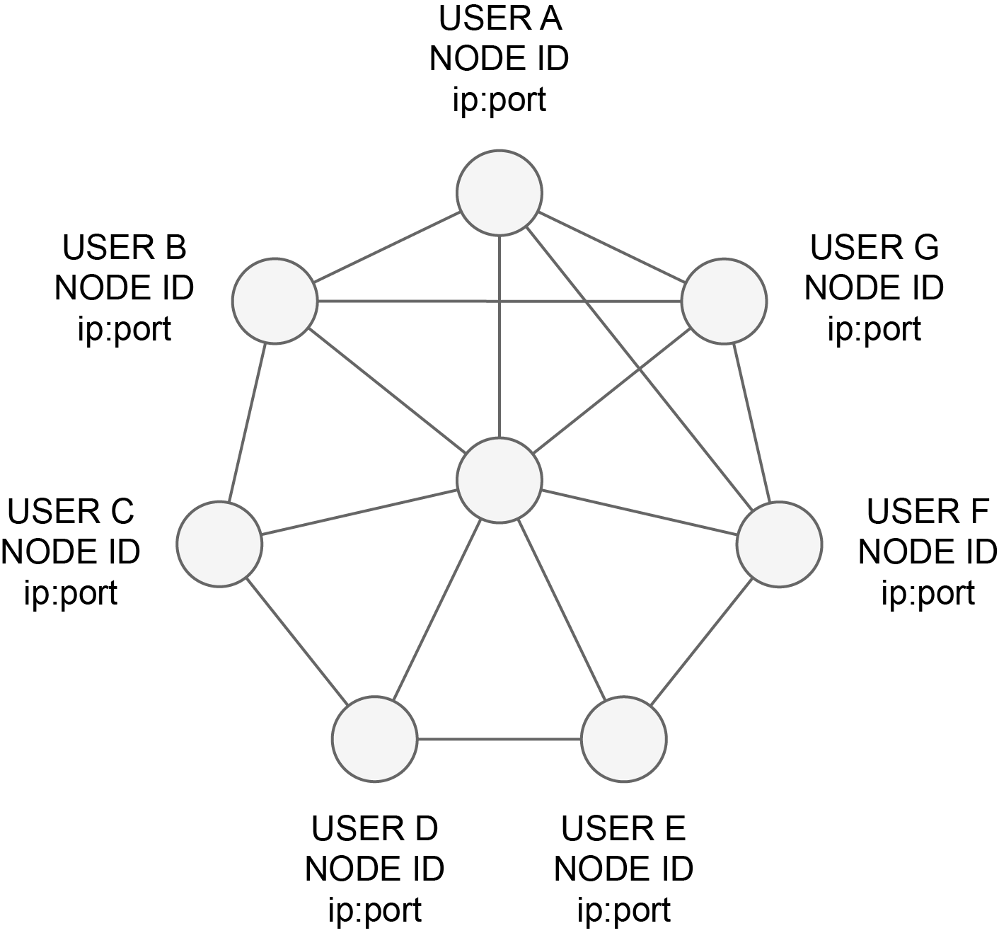
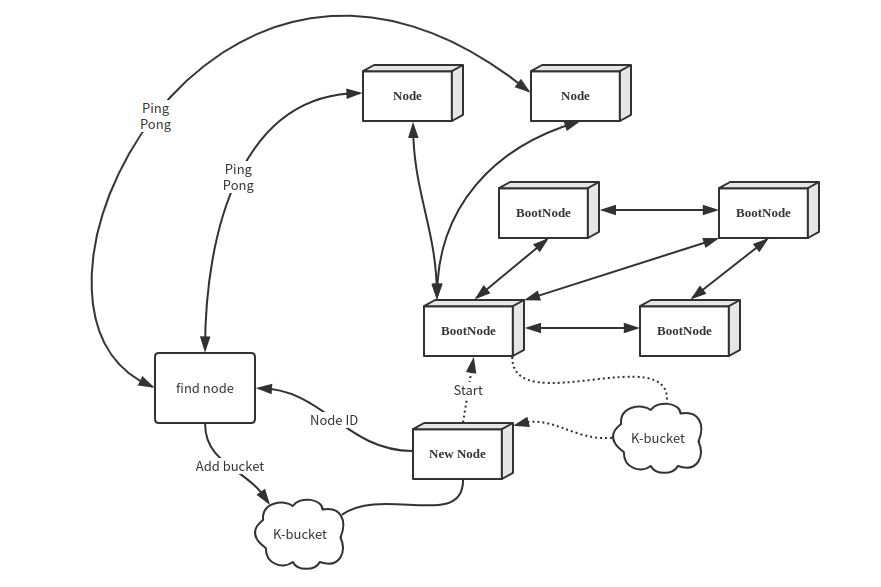

# The Network

Dipperin uses DHT(Distributed Hash Table) at P2P network structure, to improve searching effectiveness between nodes and the P2P network capability that defend DOS(Denial of Service) attack. In this case even if a whole batch of nodes in the network were attacked, the availability of the network would not be significantly affected. Dipperin uses Kademlia algorithm to realize DHT.

## Network structure

A Dipperin network is a peer-to-peer decentralized network of nodes. Each node runs the Dipperin software.

All communication between nodes is point-to-point and encrypted using transport-layer security.

## Admission to the network

Dipperin networks are public. To join a network, Node need connect the Dipperin Boot Nodes.

Before the chain release, Dipperin deploys some start nodes (BootNode), hard-coded in the program. In this way, when these nodes are started for the first time, they will connect automatically the bootnodes, exchange the K-bucket between the nodes, and obtain more nodes ID to make connections, thus joining the entire Dipperin network. 

The first time a node connects to the network it uses one of the predefined boot nodes. Through these boot nodes a node can join the network and find other nodes.
