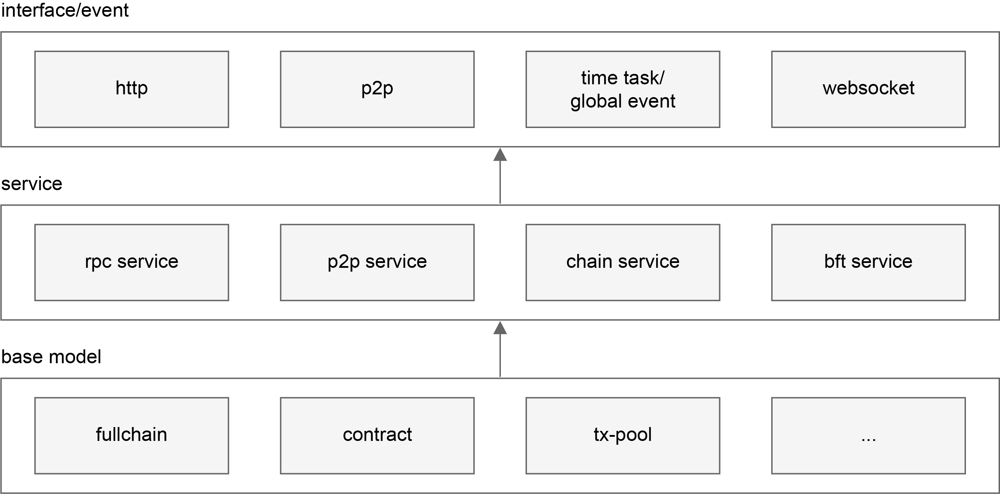

# Nodes

## Node architecture

Dipperin written in Golang. We can visualize the node's internal architecture as follows:

Dipperin node's internal is a three-tier architecture, isolates parts that have clearly different functions. 

## interface/event

This layer is the interface that triggers the node response， Users can interact with other nodes through http, websocket and p2p.

## service

This layer is to process the business logic, encapsulate the logical methods of each business module, provide an interface upwards for the upper layer to call.

## base model

This layer is mainly to achieve the underlying functions required by the node, like transaction-pool, contract base module.